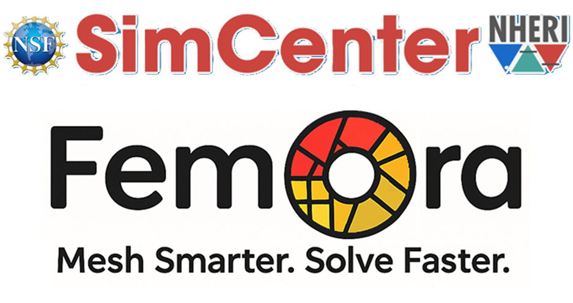

<div align="center">
  
  <h1>FEMORA</h1>
  <p><strong>Fast Efficient Meshing for OpenSees-based Resilience Analysis</strong></p>
  <p><em>A powerful Python framework for finite element meshing and seismic analysis</em></p>

  <p>
    <a href="https://pypi.org/project/femora/"></a>
    <a href="https://pypi.org/project/femora/"></a>
    <a href="https://github.com/amnp95/Femora/blob/main/LICENSE"></a>
    <a href="https://amnp95.github.io/Femora/"></a>
    <a href="https://github.com/amnp95/Femora/stargazers"></a>
  </p>
</div>

---

## Overview

**FEMORA** (Fast Efficient Meshing for OpenSees-based Resilience Analysis) is a Python-based framework designed to simplify the creation, management, and analysis of complex finite element models for seismic analysis. Built on top of [OpenSees](https://opensees.berkeley.edu/), FEMORA provides an intuitive API for mesh generation, material definition, analysis configuration, and visualization — with a specialized focus on soil dynamics, geotechnical engineering, and seismic simulations.

Whether you are a researcher performing large-scale parametric studies or an engineer building site-response models, FEMORA streamlines the entire workflow from geometry definition to OpenSees TCL export.

---

## Table of Contents

- [Key Features](#key-features)
- [Architecture Overview](#architecture-overview)
- [Installation](#installation)
- [Quick Start](#quick-start)
- [Working Modes](#working-modes)
- [Examples](#examples)
- [Documentation](#documentation)
- [Contributing](#contributing)
- [Code Style](#code-style)
- [License](#license)
- [Citing FEMORA](#citing-femora)
- [Contact](#contact)

---

## Key Features

| Feature | Description |
|---------|-------------|
| **Powerful Mesh Generation** | Create complex 3D (and 2D) soil and structural models with minimal code using an intuitive, high-level Python API |
| **HPC-Ready Domain Decomposition** | Parallel computing support with METIS-based domain decomposition for large-scale simulations |
| **Domain Reduction Method (DRM)** | Advanced seismic wave propagation technique for realistic regional-to-local scale analysis |
| **Perfectly Matched Layers (PML)** | Absorbing boundary elements to eliminate spurious wave reflections at model boundaries |
| **Comprehensive Material Library** | 50+ material models including elastic, elastoplastic, pressure-dependent, and user-defined materials |
| **Full OpenSees Coverage** | Access all elements, materials, constraints, recorders, analysis types, and algorithms available in OpenSees |
| **Built-in Visualization** | Interactive 3D visualization powered by PyVista for model inspection and result analysis |
| **OpenSees TCL Export** | Seamless export to OpenSees TCL scripts for direct simulation |
| **Dual Interface** | Both a scriptable **headless mode** (pure Python API) and an interactive **GUI mode** (Qt-based) |
| **Interfaces & Constraints** | Advanced interface elements for soil-structure interaction, contact, and coupling |

---

## Architecture Overview

FEMORA is organized into modular components, each accessible through a unified API:

```
femora/
├── material/       # Material definitions (nD, uniaxial, and more)
├── element/        # Element types (brick, tetrahedron, truss, etc.)
├── mesh/           # Mesh part creation and assembly
├── region/         # Region and subdomain management
├── constraint/     # Boundary conditions and constraints
├── damping/        # Rayleigh and other damping models
├── pattern/        # Load patterns and ground motions
├── timeseries/     # Time series for dynamic loading
├── analysis/       # Solvers, algorithms, integrators, and tests
├── recorder/       # Output recorders for results
├── drm/            # Domain Reduction Method components
├── interface/      # Interface and coupling elements
├── partitioner/    # METIS-based domain decomposition
├── process/        # Analysis process management
└── gui/            # Qt-based graphical user interface
```

All components are accessible through the top-level `femora` module via a single import.

---

## Installation

### Requirements

- **Python** 3.9 or higher
- **Operating System**: Windows, macOS, or Linux

### Option 1: Install from PyPI (Recommended)

```bash
# Headless / scripting use (no GUI)
pip install femora

# With GUI support (Qt-based interface)
pip install femora[gui]

# Full installation with all optional dependencies
pip install femora[all]

# With METIS domain decomposition support
pip install femora[metis]

# For Jupyter notebook usage
pip install femora[jupyter]
```

### Option 2: Install from Source

```bash
git clone https://github.com/amnp95/Femora.git
cd Femora

pip install -e .            # Basic (headless) installation
pip install -e ".[gui]"     # With GUI support
pip install -e ".[all]"     # Full installation with all dependencies
pip install -e ".[metis]"   # With METIS partitioner
```

### Option 3: Using Conda

```bash
# Clone the repository first
git clone https://github.com/amnp95/Femora.git
cd Femora

# Create and activate the conda environment
conda env create -f environment.yml
conda activate Femora
```

### Using a Virtual Environment (Recommended for all methods)

```bash
# Create a virtual environment
python -m venv femora-env

# Activate — Linux / macOS
source femora-env/bin/activate

# Activate — Windows
femora-env\Scripts\activate

# Then install
pip install femora
```

### Verify Installation

```python
import femora
print(femora.__version__)
```

---

## Quick Start

The following example creates a 3D layered soil profile and exports it to an OpenSees TCL file:

```python
import femora as fm

# --- Define materials ---
fm.material.create_material(
    material_category="nDMaterial",
    material_type="ElasticIsotropic",
    user_name="Dense Ottawa Sand",
    E=2.0e7, nu=0.3, rho=2.02
)

fm.material.create_material(
    material_category="nDMaterial",
    material_type="ElasticIsotropic",
    user_name="Loose Ottawa Sand",
    E=1.5e7, nu=0.3, rho=1.94
)

# --- Define elements ---
dense_elem = fm.element.create_element(
    element_type="stdBrick", ndof=3,
    material="Dense Ottawa Sand",
    b1=0.0, b2=0.0, b3=-9.81 * 2.02
)

loose_elem = fm.element.create_element(
    element_type="stdBrick", ndof=3,
    material="Loose Ottawa Sand",
    b1=0.0, b2=0.0, b3=-9.81 * 1.94
)

# --- Create mesh parts (layered soil column 20m x 20m x 18m) ---
fm.meshPart.create_mesh_part(
    category="Volume mesh",
    mesh_part_type="Uniform Rectangular Grid",
    user_name="Layer1",
    element=dense_elem,
    region=fm.region.get_region(0),
    **{"X Min": -10, "X Max": 10, "Y Min": -10, "Y Max": 10,
       "Z Min": -18, "Z Max": -8, "Nx Cells": 20, "Ny Cells": 20, "Nz Cells": 10}
)

fm.meshPart.create_mesh_part(
    category="Volume mesh",
    mesh_part_type="Uniform Rectangular Grid",
    user_name="Layer2",
    element=loose_elem,
    region=fm.region.get_region(0),
    **{"X Min": -10, "X Max": 10, "Y Min": -10, "Y Max": 10,
       "Z Min": -8, "Z Max": 0, "Nx Cells": 20, "Ny Cells": 20, "Nz Cells": 8}
)

# --- Assemble the model ---
fm.assembler.create_section(meshparts=["Layer1", "Layer2"], num_partitions=2)
fm.assembler.Assemble()

# --- Export to OpenSees TCL ---
fm.export_to_tcl("soil_model.tcl")

# --- (Optional) Launch GUI for visualization ---
# fm.gui()
```

For a complete walkthrough including seismic loading, boundary conditions, and analysis setup, see the [Quick Start Guide](https://amnp95.github.io/Femora/introduction/quick_start.html).

---

## Working Modes

FEMORA supports two complementary working modes:

### Headless Mode (Pure Python API)

Use the full Python API for programmatic model creation — ideal for automation, batch processing, parametric studies, and integration into larger workflows or CI/CD pipelines.

```python
import femora as fm

# Build model programmatically
fm.material.create_material(...)
fm.element.create_element(...)
fm.meshPart.create_mesh_part(...)
fm.assembler.Assemble()
fm.export_to_tcl("model.tcl")
```

### GUI Mode (Qt Interface)

Launch the interactive graphical interface for visual model construction, real-time 3D preview, and exploratory analysis. Ideal for rapid prototyping, teaching, and debugging.

```python
import femora as fm

# Build your model, then launch the GUI
fm.gui()
```

Install GUI dependencies with:

```bash
pip install femora[gui]
```

---

## Examples

The `examples/` directory contains ready-to-run scripts covering a wide range of applications:

### Site Response Analysis
Simulate seismic wave propagation through layered soil profiles.
- **Example 1**: 3D layered soil column under Kobe earthquake excitation
- **Example 2**: Multi-layer soil model with absorbing boundaries (PML)
- **Example 3**: Nonlinear soil response with pressure-dependent materials
- **Example 4**: Parametric study of soil column response

### Domain Reduction Method (DRM)
Couple regional seismic simulations with local site-scale models.
- **Example 1–5**: DRM application with varying source-to-site configurations

### Soil-Structure Interaction (SSI)
Model the coupled behavior of structures founded on soil.
- **Example 0–4**: Embedded foundations, pile groups, and frame structures on layered soil

### PML Verification
Validate Perfectly Matched Layer absorbing boundaries.
- Wave absorption tests in 3D media

### EE-UQ Integration
Connect with SimCenter's EE-UQ workflow for uncertainty quantification.

Browse all examples: [`examples/`](examples/) | [Online Tutorials](https://amnp95.github.io/Femora/introduction/examples.html)

---

## Documentation

Full documentation is available at **[amnp95.github.io/Femora](https://amnp95.github.io/Femora)**:

| Section | Description |
|---------|-------------|
| [Getting Started](https://amnp95.github.io/Femora/introduction/getting_started.html) | First steps: installation and setup |
| [Installation Guide](https://amnp95.github.io/Femora/introduction/installation.html) | Detailed platform-specific instructions |
| [Quick Start Tutorial](https://amnp95.github.io/Femora/introduction/quick_start.html) | Build your first model step-by-step |
| [Examples & Tutorials](https://amnp95.github.io/Femora/introduction/examples.html) | Practical examples from simple to advanced |
| [Technical Reference](https://amnp95.github.io/Femora/technical/index.html) | API documentation for all components |
| [Developer Guide](https://amnp95.github.io/Femora/developer/index.html) | Contributing, code style, and development setup |

---

## Contributing

Contributions are welcome! Here's how to get started:

1. **Fork** the repository on GitHub
2. **Clone** your fork locally: `git clone https://github.com/<your-username>/Femora.git`
3. **Create a branch** for your feature or fix: `git checkout -b feature/my-feature`
4. **Make your changes** following the [code style guidelines](#code-style)
5. **Test** your changes: `pytest tests/`
6. **Submit a pull request** with a clear description of your changes

For detailed instructions, see [CONTRIBUTING.md](CONTRIBUTING.md) and the [Developer Guide](https://amnp95.github.io/Femora/developer/index.html).

Please report bugs and request features via [GitHub Issues](https://github.com/amnp95/Femora/issues).

---

## Code Style

FEMORA follows these style guidelines:

- **Imports**: PEP 8 order (stdlib → third-party → local)
- **Classes**: PascalCase with descriptive names
- **Methods/Variables**: snake_case
- **Private attributes**: Leading underscore (`_variable_name`)
- **Type annotations**: For all function parameters and return values
- **Documentation**: Google-style docstrings for all classes and methods
- **Error handling**: Explicit exceptions with descriptive messages

See [STYLE_GUIDE.md](STYLE_GUIDE.md) for the complete guide.

---

## License

This project is licensed under the **MIT License** — see the [LICENSE](LICENSE) file for details.

---

## Citing FEMORA

If you use FEMORA in your research or projects, please cite it as:

```bibtex
@software{femora2025,
  author    = {Amin Pakzad and Pedro Arduino},
  title     = {{FEMORA}: {F}ast {E}fficient {M}eshing for {O}pen{S}ees-based {R}esilience {A}nalysis},
  year      = {2025},
  url       = {https://github.com/amnp95/Femora},
  note      = {University of Washington}
}
```

---

## Contact

**Amin Pakzad** — [amnp95@uw.edu](mailto:amnp95@uw.edu) — University of Washington  
**Pedro Arduino** — [parduino@uw.edu](mailto:parduino@uw.edu) — University of Washington

- **Bug reports & feature requests**: [GitHub Issues](https://github.com/amnp95/Femora/issues)
- **Discussions & questions**: [GitHub Discussions](https://github.com/amnp95/Femora/discussions)
- **Documentation**: [amnp95.github.io/Femora](https://amnp95.github.io/Femora)
- **Source code**: [github.com/amnp95/Femora](https://github.com/amnp95/Femora)