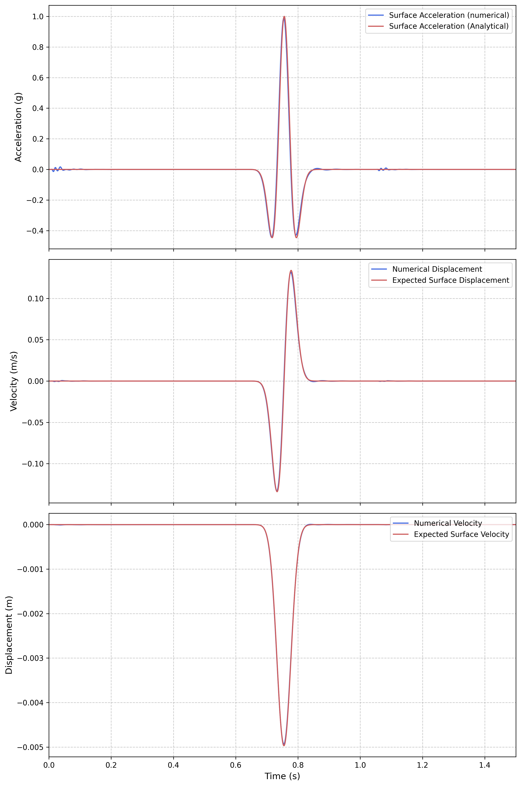

Example 1: Domain Reduction Method (DRM) Site Response Analysis
===============================================================

Overview
--------

This example demonstrates the Domain Reduction Method (DRM) implementation in Femora for site response analysis. Building upon the foundation established in Site Response Examples 3 and 4, this example shows how to:

1. Use the deconvolved bedrock motion from Site Response Example 4 as DRM input
2. Apply the 3D mesh configuration from Site Response Example 3 for DRM analysis
3. Create and apply DRM load patterns using the ``TransferFunction`` tool
4. Configure absorbing boundary layers for realistic wave absorption
5. Compare DRM results with analytical solutions and previous site response analyses

The DRM approach provides a more realistic representation of seismic wave propagation by applying motion at interior boundaries rather than uniform base excitation, making it particularly valuable for complex site response and soil-structure interaction problems.

.. figure:: ../images/DRM/Example1/bedrock_acceleration.png
   :width: 600px
   :align: center
   :alt: Bedrock and Expected Surface Acceleration

   Bedrock acceleration input (computed via deconvolution in Site Response Example 4) and expected surface response

Model Description
-----------------

**Relationship to Previous Examples:**

This example combines key elements from two previous site response examples:

* **From Site Response Example 3:** The 3D mesh configuration (10m × 10m × 18m domain) with multi-layer soil profile
* **From Site Response Example 4:** The deconvolved bedrock motion (Ricker wavelet) obtained through transfer function analysis

**Soil Profile:**

The model uses the same three-layer soil profile as Examples 2-4:

* **Layer 1 (Top):** 2.6m thick - Dense Ottawa sand (Vs = 262.5 m/s)
* **Layer 2 (Middle):** 8.0m thick - Medium density material (Vs = 196.3 m/s)  
* **Layer 3 (Bottom):** 7.4m thick - Loose Ottawa sand (Vs = 144.3 m/s)

All layers include frequency-dependent Rayleigh damping with the same parameters as previous examples (f1 = 2.76 Hz, f2 = 13.84 Hz, ζ = 3%).

**Domain Configuration:**

* **Horizontal dimensions:** 10m × 10m (identical to Site Response Example 3)
* **Vertical extent:** 18m depth (same as all site response examples)
* **Mesh discretization:** 1m × 1m horizontal elements with variable vertical spacing
* **Parallel processing:** 4 partitions for distributed computation

Domain Reduction Method Implementation
--------------------------------------

The DRM implementation in this example introduces several new concepts not covered in the site response examples:

Creating the DRM Load Pattern
~~~~~~~~~~~~~~~~~~~~~~~~~~~~~

The key innovation in this example is the creation of DRM load patterns using the ``TransferFunction`` class. This process involves several steps that are unique to DRM analysis:

.. code-block:: python

    from femora.tools.transferFunction import TransferFunction, TimeHistory

    # Load the deconvolved bedrock motion from Site Response Example 4
    record = TimeHistory.load(acc_file="ricker_base.acc",
                              time_file="ricker_base.time",
                              unit_in_g=True,
                              gravity=9.81)

    # Create transfer function instance with soil profile
    tf = TransferFunction(soil, rock, f_max=50.0)

    # Extract the assembled mesh for DRM pattern creation
    mesh = fm.assembler.get_mesh()

    # Create DRM pattern - this is the key new functionality
    tf.createDRM(mesh, props={"shape":"box"}, 
                 time_history=record, filename="drmload.h5drm")

The ``createDRM`` method performs several critical operations:

1. **Mesh Analysis:** Identifies boundary nodes that will receive DRM forces
2. **Wave Field Computation:** Calculates the theoretical wave field throughout the domain
3. **Force Calculation:** Computes equivalent nodal forces for DRM implementation
4. **HDF5 Output:** Writes the DRM load pattern to an HDF5 file for efficient loading

Applying the DRM Pattern
~~~~~~~~~~~~~~~~~~~~~~~~

Once the DRM load pattern is created, it's applied to the model using Femora's pattern system:

.. code-block:: python

    # Create H5DRM pattern object
    h5pattern = fm.pattern.create_pattern('h5drm',
                                         filepath='drmload.h5drm',
                                         factor=1.0,
                                         crd_scale=1.0,
                                         distance_tolerance=0.01,
                                         do_coordinate_transformation=1,
                                         transform_matrix=[1.0, 0.0, 0.0, 0.0, 1.0, 0.0, 0.0, 0.0, 1.0],
                                         origin=[0.0, 0.0, 0.0])

This creates a specialized pattern that can read and apply the HDF5-based DRM loads throughout the analysis.

Absorbing Boundary Configuration
~~~~~~~~~~~~~~~~~~~~~~~~~~~~~~~~

A critical component of DRM analysis is the proper configuration of absorbing boundaries to prevent artificial wave reflections:

.. code-block:: python

    # Add absorbing layers around the domain
    fm.drm.addAbsorbingLayer(numLayers=2,
                            numPartitions=1,
                            partitionAlgo="kd-tree",
                            geometry="Rectangular",
                            rayleighDamping=0.95,
                            matchDamping=False,
                            type="Rayleigh")

This configuration:

* **numLayers=2:** Creates a two-layer absorbing boundary
* **rayleighDamping=0.95:** Applies high damping (95%) in the absorbing region
* **geometry="Rectangular":** Configures absorbing boundaries for box-shaped domains
* **partitionAlgo="kd-tree":** Uses k-d tree algorithm for efficient boundary identification

DRM Process Configuration
~~~~~~~~~~~~~~~~~~~~~~~~~

The DRM analysis requires specific process configuration that differs from standard site response analysis:

.. code-block:: python

    # Set the DRM pattern
    fm.drm.set_pattern(h5pattern)

    # Create DRM-specific analysis process
    fm.drm.createDefaultProcess(finalTime=2.0, dT=0.005,
                               vtkhdfrecorder_delta_t=0.005,
                               vtkhdfrecorder_file=f"{resultdirectoryname}/result")

This creates a complete analysis process specifically configured for DRM analysis, including:

* Time integration parameters optimized for DRM
* Output recorders configured for DRM visualization
* Proper sequencing of DRM load application

Results and Analysis
--------------------

Transfer Function Validation
~~~~~~~~~~~~~~~~~~~~~~~~~~~~

The transfer function comparison demonstrates that the DRM method accurately reproduces the expected site response:

   Comparison of analytical transfer function with DRM numerical results

The excellent agreement between the analytical and DRM numerical results validates:

1. The accuracy of the DRM load pattern generation
2. The proper implementation of absorbing boundaries
3. The consistency with previous site response analyses

Time History Comparison
~~~~~~~~~~~~~~~~~~~~~~~

The most comprehensive validation comes from comparing time histories of acceleration, velocity, and displacement:

   Comparison of numerical DRM results with analytical solutions for acceleration, velocity, and displacement

This comparison shows:

* **Acceleration:** Excellent agreement in both amplitude and phase
* **Velocity:** Consistent integration from acceleration with proper baseline correction
* **Displacement:** Accurate representation of permanent deformation patterns

The close agreement across all response quantities demonstrates the robustness of the DRM implementation.

3D Wave Propagation Visualization
~~~~~~~~~~~~~~~~~~~~~~~~~~~~~~~~~

The DRM method provides detailed insight into wave propagation through the 3D domain:

.. raw:: html

   <video width="600" controls>
     <source src="../images/DRM/Example1/movieRickter.mp4" type="video/mp4">
     Your browser does not support the video tag.
   </video>

This animation shows:

1. **Shear Stress Contours:** Distribution of shear stress throughout the deformed domain
2. **Wave Propagation:** Realistic wave fronts propagating from the DRM boundary
3. **Layer Effects:** Amplification and attenuation effects at layer interfaces
4. **Absorbing Boundaries:** Effective wave absorption at domain boundaries

Advantages of DRM Over Uniform Excitation
------------------------------------------

This example demonstrates several key advantages of the DRM approach compared to the uniform base excitation used in Site Response Examples 1-3:

**Physical Realism:**

* DRM applies motion at interior boundaries, mimicking actual wave propagation
* Allows for more complex wave fields including oblique incidence
* Enables modeling of finite fault sources and complex source mechanisms

**Computational Efficiency:**

* Smaller computational domains due to effective absorbing boundaries
* Reduced artificial reflections from domain boundaries
* Better representation of far-field conditions

**Flexibility:**

* Can accommodate complex geometries and topography
* Suitable for soil-structure interaction problems
* Enables coupling with regional wave propagation models

Relationship to Site Response Examples
--------------------------------------

This DRM example builds directly on the foundation established in the site response series:

**From Site Response Example 3:**
* 3D mesh configuration and parallel processing setup
* Multi-layer soil profile definition and material properties
* Visualization and post-processing techniques

**From Site Response Example 4:**
* Deconvolution methodology using the ``TransferFunction`` class
* Bedrock motion calculation from surface recordings
* Time history validation approaches

**New Concepts Introduced:**
* DRM load pattern generation and application
* Absorbing boundary layer configuration
* HDF5-based load pattern management
* DRM-specific analysis process setup

The seamless integration of these concepts demonstrates the modular design of Femora and the consistency of the analysis framework across different seismic analysis methods.

Practical Applications
----------------------

The DRM methodology demonstrated in this example is particularly valuable for:

**Regional Seismic Analysis:**
* Coupling site-specific models with regional wave propagation simulations
* Modeling earthquake scenarios with realistic source mechanisms
* Analyzing basin effects and complex 3D wave propagation

**Soil-Structure Interaction:**
* More realistic representation of free-field motion around structures
* Reduced computational domain size for large structural systems
* Better modeling of structure-induced wave scattering

**Advanced Site Response:**
* Incorporation of topographic effects on site amplification
* Modeling of complex layering and lateral variations
* Analysis of slope stability under seismic loading

Conclusion
----------

This example demonstrates:

1. The successful implementation of the Domain Reduction Method in Femora
2. Integration of deconvolution tools with DRM load pattern generation
3. Effective use of absorbing boundaries for realistic wave propagation modeling
4. Validation of DRM results against analytical solutions and previous examples

The DRM approach provides a powerful extension to the site response analysis capabilities demonstrated in the previous examples, offering greater physical realism and computational flexibility for complex seismic analysis problems.

Code Access
-----------

The full source code for this example is available in the Femora repository:

* Example directory: ``examples/DRM/Example1/``
* DRM model script: ``examples/DRM/Example1/femoramodel.py``
* Post-processing script: ``examples/DRM/Example1/plot.py``
* Animation script: ``examples/DRM/Example1/movie.py``

The complete model setup code is shown below:

.. literalinclude:: ../../../examples/DRM/Example1/femoramodel.py
   :language: python
   :caption: Example 1 - Domain Reduction Method Site Response Analysis
   :name: DRM_example1-code
