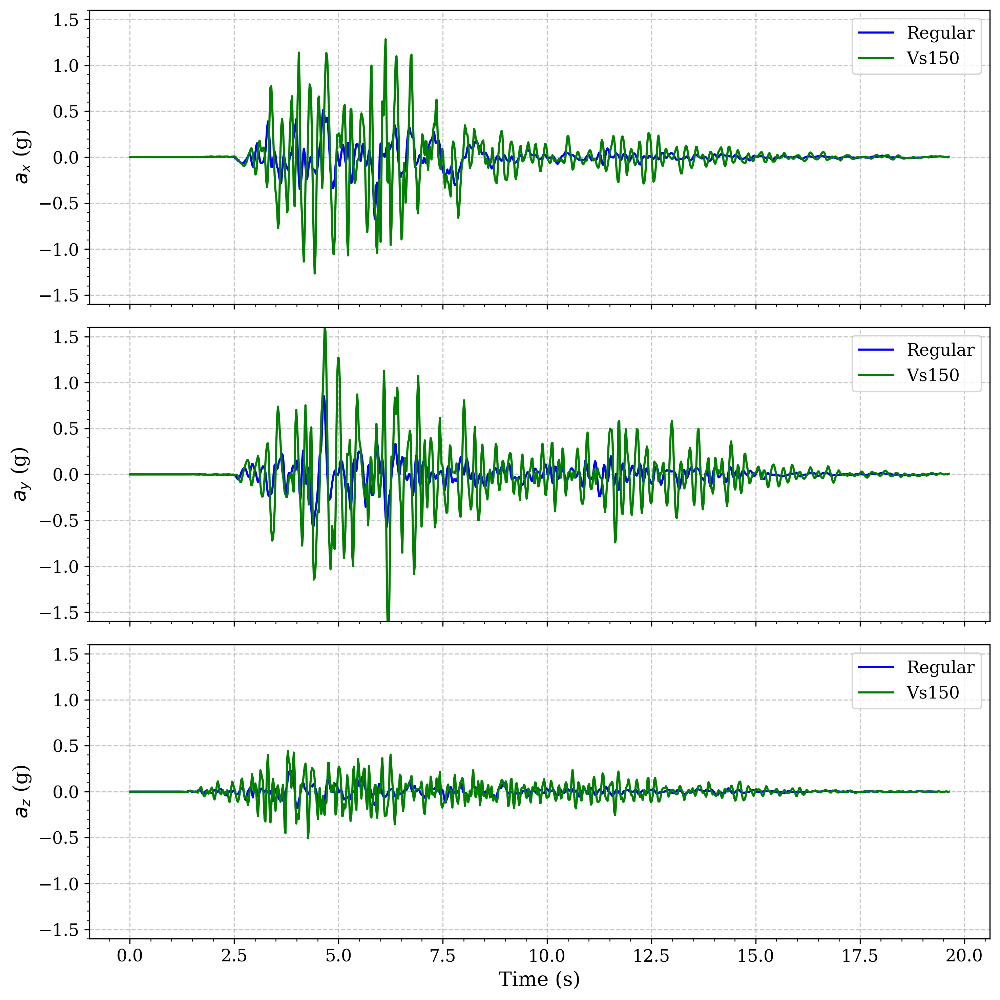

Example 3: Seismic Wave Basin Effects Model with External Mesh
==============================================================

Overview
--------

This example extends Example 2 by incorporating a semi-hemispherical basin with soft soil materials to demonstrate how basins affect seismic wave propagation. The model uses external mesh parts to precisely define the basin geometry and applies different soft material properties to study their impact on ground motion amplification.

Basin effects represent one of the most significant site amplification phenomena in earthquake engineering. Sedimentary basins can trap seismic waves, causing resonance, extended duration of shaking, and amplification of ground motion. These effects have been observed in many major earthquakes, such as the 1985 Mexico City earthquake, the 1994 Northridge earthquake, and the 1995 Kobe earthquake, where localized damage was strongly correlated with basin geometry and soft soil deposits.

The model enhancements in this example include:

* A semi-hemispherical basin embedded in the soil profile, representing a simplified version of real-world geological basin structures
* Use of external mesh for complex geometry modeling, demonstrating Femora's capability to handle non-rectangular geometries
* Soft soil materials in the basin with varying shear wave velocities (Vs=150 m/s and Vs=200 m/s) to study velocity contrast effects
* Comparative analysis of seismic response with different basin properties to quantify amplification factors

This example demonstrates Femora's capability to model complex subsurface geometries and analyze their effects on seismic wave propagation, which is essential for site-specific seismic hazard assessment in regions with complex geological conditions.

Schematic Model Representation
------------------------------

Before implementing the detailed basin model, let's first understand the conceptual geometry. The basin is created by intersecting a half-sphere with a rectangular ground layer box:

.. raw:: html

    

        <iframe src="../images/DRM/Example3/schematic_model.html" style="width: 100%; height: 100%; border: none;"></iframe>
    

This schematic visualization illustrates the geometric construction of the semi-hemispherical basin:

* **Blue Box**: Represents the ground layer box (the soil domain)
* **Red Half-Sphere**: Represents the geometric shape used to create the basin
* **Green Region**: Shows the intersection of the box and half-sphere, forming the semi-hemispherical basin that will be used in the model

This boolean operation approach (intersection of a sphere and box) provides a precise way to define the semi-hemispherical basin geometry. In the actual implementation, we'll use a similar approach but with finite element meshes rather than continuous geometric objects.

Model Description
-----------------

**Basin Geometry:**

* Semi-hemispherical basin shape - chosen for its geometric simplicity while still capturing the essential physics of wave focusing and multi-dimensional resonance
* Center coordinates: (0, 0, 70) meters - positioned at the top surface of the model to maximize surface wave interaction
* Radius: 85 meters - selected to create significant basin effects while maintaining computational efficiency
* Only intersects with Layer 1 and Layer 2 of the soil profile - allowing study of soft soil deposits in the near-surface region most important for engineering applications
* External mesh implementation for precise geometric representation - enabling accurate modeling of the curved basin interface that cannot be achieved with rectilinear elements

**Basin Material Properties:**

* Two soft material variants tested to evaluate velocity contrast sensitivity:
    * Vs = 150 m/s (primary model) - representing soft sediments
    * Vs = 200 m/s (comparison model) - representing slightly stiffer but still soft sedimentary materials
* Vp/Vs ratio maintained at 2.0 
* Reduced density: 1.8 ton/m³ (compared to ~2.14 ton/m³ for surrounding soil) - representative of younger, less compacted deposits
* Damping ratio (xi_s): 0.03 (higher than surrounding soil) - accounting for the higher hysteretic energy dissipation characteristic of softer materials

Step-by-Step Model Development
------------------------------

This section outlines the key steps in developing this model, focusing on the differences and enhancements from Example 2.

1. Initial Setup and Basin Configuration
~~~~~~~~~~~~~~~~~~~~~~~~~~~~~~~~~~~~~~~~

First, the semi-hemispherical basin is defined with its geometric parameters:

.. code-block:: python

    # Parameters for the semihemispherical hole
    center_x, center_y, center_z = 0, 0, 70  # Center at the top surface
    radius = 85.0  # Radius of the semihemisphere

These parameters establish that the basin:

    - Is centered at the origin in the horizontal plane (x,y = 0,0)
    - Has its top at z=70 m (at the ground surface)
    - Extends downward with a radius of 85 m

The center and radius parameters were carefully chosen to create significant basin effects while maintaining computational efficiency. A larger radius would increase computational demands, while a smaller one might not produce noticeable basin effects. The z-coordinate of 70m places the basin's top at the ground surface, which is realistic for many sedimentary basins formed by erosion and deposition processes.

Based on these parameters, the basin intersects with the top two soil layers (Layer 1 and Layer 2), as calculated in the code comments:

.. code-block:: python

    # according to the center of the semihemisphere and it raduis the bounds
    # of the mesh is as follows:
    #       xmin = center_x - radius = - 85.0
    #       xmax = center_x + radius = 85.0
    #       ymin = center_y - radius = - 85.0
    #       ymax = center_y + radius = 85.0
    #       zmin = center_z - radius = - 15.0
    #       zmax = center_z + radius = 40.0
    # so according to the below values only the layer 1 and layer 2 are intersecting with the semihemisphere

This geometry calculation is crucial for understanding which layers need special treatment with external meshes. By determining that only Layers 1 and 2 intersect with the basin, we can optimize our approach by applying external mesh techniques only where needed, using simpler rectangular grid meshes for the deeper layers.

2. Interactive Mesh Visualization
~~~~~~~~~~~~~~~~~~~~~~~~~~~~~~~~~

Before diving into the implementation details, let's visualize what we're trying to build. The model uses PyVista to create interactive visualizations of the mesh components, providing intuitive insight into the complex 3D geometry:

**Basin Components Visualization**: 
The semi-hemispherical basin split into two parts (basin1 and basin2) corresponding to its intersection with Layer 1 and Layer 2:

.. raw:: html

    

        <iframe src="../images/DRM/Example3/basin.html" style="width: 100%; height: 100%; border: none;"></iframe>
    

In this interactive visualization, we can see basin1 (intersecting with Layer 1) in red and basin2 (intersecting with Layer 2) in blue. The semi-hemispherical shape is clearly visible, showing how the basin structure is defined in the model. This division into two parts is not just for visualization purposes – it reflects how the basin is physically modeled in the simulation, with each part potentially assigned different material properties. The curved boundary of the semi-hemisphere is particularly important for capturing realistic wave propagation behaviors including focusing effects that would not be present with simpler geometries.

.. note::
   When examining the basin visualization closely, you'll notice that the boundary between the basin and surrounding soil is not perfectly smooth but has a "stair-stepped" appearance. This occurs because we extract entire hexahedral elements based on their cell centers' distances from the basin center. If a cell center falls within the radius, the entire element is included in the basin, creating a crenellated boundary with vertical and horizontal faces rather than a smooth curve. While this might introduce some additional wave reflections at the boundary, it can also be considered realistic in many geological settings where basin boundaries are often irregular and non-smooth due to natural depositional and erosional processes. This discretization effect is an inherent characteristic of structured element meshes when representing curved geometries, and becomes less pronounced with finer mesh resolution.

**Layer Structure Visualization**:
The six soil layers each shown with a different color:

.. raw:: html

    

        <iframe src="../images/DRM/Example3/layers.html" style="width: 100%; height: 100%; border: none;"></iframe>
    

This visualization shows the six soil layers of the model, each with a distinct color to illustrate the layered structure. You can rotate, zoom, and pan the model to examine the layer boundaries. Note how each layer has a uniform thickness and horizontal extent – this represents the idealized soil profile. In real geological settings, these layers would rarely be perfectly uniform, but this simplification allows us to isolate the basin effects from other potential variables.

**Complete Model Visualization**:
The combined visualization showing the basin embedded within the layered soil:

.. raw:: html

    

        <iframe src="../images/DRM/Example3/layers_basin.html" style="width: 100%; height: 100%; border: none;"></iframe>
    

This comprehensive visualization displays the complete model with regular soil layers (blue) and basin components (red). It illustrates how the semi-hemispherical basin is integrated into the soil profile, affecting only the top two layers. This visualization is particularly valuable for understanding the relationship between the basin geometry and the surrounding soil structure. Note that the mesh elements maintain their regular pattern outside the basin but conform to the curved basin boundary where they intersect – this is a key advantage of the external mesh approach used in this example.

3. Soft Material Definition for the Basin
~~~~~~~~~~~~~~~~~~~~~~~~~~~~~~~~~~~~~~~~~

Unlike Example 2 which used consistent material properties throughout each layer, Example 3 introduces a soft material for the basin. This is a key difference and is implemented as follows:

.. code-block:: python

    # Defining soft material for the basin
    BASIN = True
    softMat_vs = 150          # Shear wave velocity (m/s)
    softMat_vp = 300          # P-wave velocity (m/s)
    softMat_xi_s = 0.03       # Damping ratio for shear waves
    softMat_xi_p = 0.01       # Damping ratio for pressure waves
    softMat_rho = 1.8         # Density (ton/m³)
    
    # Calculate elastic parameters from wave velocities
    softMat_vs_vp_ratio = (softMat_vp / softMat_vs) ** 2
    softMat_nu = (softMat_vs_vp_ratio - 2) / (2 * (softMat_vs_vp_ratio - 1))
    softMat_E = 2 * softMat_rho * (softMat_vs ** 2) * (1 + softMat_nu)

    # Create Femora material, element, damping, and region for soft material
    sofmat = fm.material.create_material("nDMaterial", "ElasticIsotropic",
                                    user_name=f"softMaterial",
                                    E=softMat_E, nu=softMat_nu, rho=softMat_rho)

    softele = fm.element.create_element(element_type="stdBrick",
                                    ndof=3,
                                    material=sofmat,
                                    b1=0,
                                    b2=0,
                                    b3=0)
    softMat_damp = fm.damping.create_damping("frequency rayleigh", dampingFactor=softMat_xi_s, f1=3, f2=15)
    softMat_reg = fm.region.create_region("elementRegion", damping=softMat_damp)

.. note::
   This example uses elastic isotropic material for the soft basin soil. In real seismic events, soft soils with such low shear wave velocities (Vs=150 m/s) would likely experience nonlinear behavior and enter the plastic region even at moderate shaking intensities. The elastic material assumption may exaggerate wave amplification effects since it doesn't account for:
   
   1. **Energy dissipation through hysteresis** - In reality, soft soils dissipate energy through plastic deformation, which reduces amplification
   2. **Strain-dependent stiffness reduction** - Soft soils experience significant stiffness degradation at relatively low strain levels
   3. **Permanent deformation** - Plastic response can lead to permanent settlement and lateral spreading
   4. **Damping increase with strain level** - Material damping typically increases as the soil enters the nonlinear range
   
   In a subsequent example, we will implement more realistic elastoplastic constitutive models for the soft basin material to demonstrate how nonlinear behavior affects seismic wave amplification and basin response.

The soft material definition demonstrates several important geotechnical principles:

1. **Wave Velocity Relationship**: The code maintains a specific relationship between P-wave (Vp) and S-wave (Vs) velocities, with Vp/Vs = 2.0. This ratio is typical for water-saturated sediments and corresponds to a Poisson's ratio (ν) of approximately 0.33, which is calculated using the formula:

   .. math::
      
      \nu = \frac{(V_p/V_s)^2 - 2}{2[(V_p/V_s)^2 - 1]}

2. **Elastic Parameter Conversion**: Rather than directly specifying Young's modulus (E) and Poisson's ratio (ν), the code derives these parameters from wave velocities using the relationship:

   .. math::
      
      E = 2\rho V_s^2 (1 + \nu)
   
   This approach ensures consistency between the dynamic properties (wave velocities) and static elastic parameters.

3. **Damping Implementation**: The model uses frequency-dependent Rayleigh damping with a higher damping ratio for soft materials (3% vs. typically 2-2.5% for stiffer soils). The damping is calibrated at two frequencies (f1=3Hz and f2=15Hz) that span the typical frequency range of engineering interest.

4. **Material Controls**: The `BASIN` boolean flag functions as a master switch for the soft material implementation, allowing easy toggling between models with and without basin effects. This facilitates direct comparison of site response with and without the basin structure.

4. External Mesh Implementation for Complex Geometry
~~~~~~~~~~~~~~~~~~~~~~~~~~~~~~~~~~~~~~~~~~~~~~~~~~~~

For layers 1 and 2 that intersect with the basin, the implementation requires a special approach using external meshes. This is another key difference from Example 2:

.. code-block:: python

    # Example for Layer 2 (Layer 1 follows the same pattern)
    layer, rho, vp, vs, xi_s, xi_p, thickness = layers[1]  # Get Layer 2 properties
    ele, reg = helperfunction(layer, rho, vp, vs, xi_s, xi_p, thickness)
    zmin = zmax
    zmax = zmin + thickness
    Nz = int(thickness/dz)

    # Create structured grid for the entire layer
    x = np.linspace(xmin, xmax, Nx+1)
    y = np.linspace(ymin, ymax, Ny+1)
    z = np.linspace(zmin, zmax, Nz+1)
    x, y, z = np.meshgrid(x, y, z, indexing='ij')
    mesh = pv.StructuredGrid(x, y, z).cast_to_unstructured_grid()

    # Identify cells inside and outside the basin based on distance from center
    cellcenters = mesh.cell_centers()
    distances = np.sqrt((cellcenters.points[:, 0] - center_x)**2 +
                        (cellcenters.points[:, 1] - center_y)**2 +
                        (cellcenters.points[:, 2] - center_z)**2)
    mask = (distances <= radius)

    # Extract separate mesh components
    semihemisphere = mesh.extract_cells(mask)  # Basin part
    boxwithhole = mesh.extract_cells(~mask)    # Regular soil part

    # Add regular soil part to Femora
    fm.meshPart.create_mesh_part("General mesh", "External mesh",
                            user_name=f"Layer{layer}",
                            element=ele,
                            region=reg,
                            mesh=boxwithhole)

    # Add basin part with appropriate material
    if BASIN:
        fm.meshPart.create_mesh_part("General mesh", "External mesh",
                                    user_name=f"basin{layer}",
                                    element=softele,
                                    region=softMat_reg,
                                    mesh=semihemisphere)
    else:
        fm.meshPart.create_mesh_part("General mesh", "External mesh",
                                    user_name=f"basin{layer}",
                                    element=ele,
                                    region=reg,
                                    mesh=semihemisphere)

The external mesh implementation demonstrates several advanced computational techniques:

1. **Structured to Unstructured Grid Conversion**: 
   The code first creates a structured grid (`pv.StructuredGrid`) with regular spacing but then converts it to an unstructured grid (`cast_to_unstructured_grid()`). This transformation is necessary because structured grids cannot represent complex geometries like the basin boundary, while unstructured grids can adapt to arbitrary shapes.

2. **Distance-Based Cell Selection**: 
   The implementation uses a mathematical distance calculation to identify which cells lie within the basin boundary. This Euclidean distance formula:

   .. math::

      d = \sqrt{(x_{cell} - x_{center})^2 + (y_{cell} - y_{center})^2 + (z_{cell} - z_{center})^2}

   creates a perfect spherical boundary, which when intersected with the layered domain creates the semi-hemispherical basin shape.

3. **Boolean Masking for Mesh Extraction**: 
   The PyVista library's `extract_cells()` method with a boolean mask provides an efficient way to separate the mesh into two complementary components without needing to recreate the geometry. This preserves the original cell quality and maintains exact matching at the basin-soil interface.

4. **Material Assignment Strategy**:
   The conditional structure using the `BASIN` flag demonstrates how to create parametric studies in Femora. This single variable controls whether the basin contains soft material (realistic scenario) or normal soil material (control scenario), enabling precise quantification of basin effects.

For layers 3-6 which don't intersect with the basin, the implementation remains the same as in Example 2, using regular uniform rectangular grids. This hybrid approach—using external meshes only where geometric complexity demands it—optimizes computational resources while maintaining model accuracy.

5. Assembly with Separate Sections
~~~~~~~~~~~~~~~~~~~~~~~~~~~~~~~~~~

To optimize computational performance, the model creates separate assembly sections for regular soil layers and basin components:

.. code-block:: python

    # Regular soil layers
    layers = ["Layer1", "Layer2", 
              "Layer3", "Layer4", 
              "Layer5", "Layer6"]
    fm.assembler.create_section(layers, num_partitions=8)

    # Basin components
    basins = ["basin1", "basin2"]
    fm.assembler.create_section(basins, num_partitions=2)

    fm.assembler.Assemble()

This organization strategy demonstrates advanced parallel computing concepts:

1. **Domain Decomposition**: By separating the model into distinct sections (regular layers and basin components), Femora can perform domain decomposition, a key technique in parallel computing where different parts of the model are assigned to different processors.

2. **Load Balancing**: The different number of partitions for regular layers (8) versus basin components (2) reflects the relative computational demand and size of these regions. This balanced partitioning helps optimize computational resources.

3. **Interface Management**: During assembly, Femora automatically handles the interfaces between different sections, ensuring proper connectivity between the basin and surrounding soil at their shared boundaries.

4. **Scalability**: This partitioning approach improves the model's scalability, allowing it to efficiently utilize available computational resources whether running on a laptop or high-performance computing cluster.

6. Absorbing Boundary and Simulation Setup
~~~~~~~~~~~~~~~~~~~~~~~~~~~~~~~~~~~~~~~~~~

The absorbing boundary implementation differs slightly from Example 2, using Rayleigh-type damping:

.. code-block:: python

    fm.drm.addAbsorbingLayer(numLayers=8,
                           numPartitions=8,
                           partitionAlgo="kd-tree",
                           geometry="Rectangular",
                           rayleighDamping=0.95,
                           matchDamping=False,
                           type="Rayleigh",
                           )

This absorbing boundary implementation showcases several advanced wave absorption concepts:

1. **Rayleigh vs. PML**: While Example 2 used Perfectly Matched Layer (PML) boundaries, Example 3 uses Rayleigh-type damping. This choice is deliberate for basin modeling, as Rayleigh damping offers:
    - Better stability for models with large impedance contrasts (like soft basins)
    - More robust performance when evanescent waves are present

2. **Layer Configuration**: The 8-layer absorbing boundary represents a balance between computational efficiency and absorption quality. More layers would improve absorption but increase computational cost.

3. **High Damping Coefficient**: The 0.95 Rayleigh damping coefficient is close to critical damping, providing strong energy absorption at the model boundaries to minimize artificial reflections.

4. **K-D Tree Partitioning**: The "kd-tree" partitioning algorithm is particularly well-suited for the complex geometry in this model, as it efficiently subdivides space without requiring regular patterns, adapting to both the basin shape and rectangular boundaries.

7. Dynamic Output Organization
~~~~~~~~~~~~~~~~~~~~~~~~~~~~~~

Example 3 implements a dynamic approach to output organization based on the model configuration:

.. code-block:: python

    # Set result directory name based on whether basin is enabled and its Vs
    if not BASIN:
        resultdirectoryname = "Regular"
    else:
        resultdirectoryname = f"Vs{int(softMat_vs)}"

    # Create default process with result path based on configuration
    fm.drm.createDefaultProcess(finalTime=25, dT=0.01,
                              vtkhdfrecorder_file=f"{resultdirectoryname}/result",
                              GravityElasticOptions={"num_steps":10},
                              GravityPlasticOptions={"num_steps":1})

    # Create output directory
    fm.process.insert_step(index=0, component=fm.actions.tcl(f"file mkdir {resultdirectoryname}"), 
                          description="making result directory")

This dynamic output organization demonstrates several sophisticated workflow concepts:

1. **Parameterized Output Paths**: By dynamically naming directories based on model parameters (Regular, Vs150, Vs200), the code establishes a direct link between simulation configuration and result storage. This systematic organization is essential for parameter studies where multiple model variations are being compared.

2. **Simulation Process Configuration**: The `createDefaultProcess` method configures the complete simulation workflow, including:
   - Simulation duration (finalTime=25s) - sufficient to capture basin resonance effects
   - Time-step size (dT=0.01s) - appropriate for capturing frequencies up to 50 Hz
   - Output file configuration (vtkhdfrecorder_file) with dynamic path assignment
   - Multi-step gravity initialization (elastic followed by plastic steps) - crucial for establishing proper initial stress states

3. **TCL Command Integration**: The use of `fm.actions.tcl` demonstrates Femora's ability to interact directly with the underlying OpenSees TCL interpreter. This allows for direct filesystem operations (creating directories) that would otherwise be more complex to implement.

4. **Process Workflow Modification**: The `insert_step` method shows how Femora's process can be modified programmatically, inserting the directory creation step at the beginning (index=0) of the simulation process.

8. Custom DRM Simulation Process
~~~~~~~~~~~~~~~~~~~~~~~~~~~~~~~~

The example demonstrates how to customize the default DRM simulation process provided by Femora to suit specific modeling needs. The `createDefaultProcess` method in the DRM module offers extensive customization options:

.. code-block:: python

    # Customizing the DRM simulation process
    fm.drm.createDefaultProcess(
        finalTime=25,                                      # Total simulation time
        dT=0.01,                                           # Time step for analysis
        vtkhdfrecorder_file=f"{resultdirectoryname}/result", # Custom output directory
        GravityElasticOptions={"num_steps":10},            # Reduced elastic gravity steps
        GravityPlasticOptions={"num_steps":1}              # Minimal plastic steps (sufficient for elastic materials)
    )

This customization addresses several specific needs for the basin model:

1. **Custom Output Organization**: 
   By specifying a dynamic directory name in `vtkhdfrecorder_file`, the results from different model configurations (Regular, Vs150, Vs200) are automatically stored in separate directories. This eliminates the need for manual file management between simulation runs.

2. **Optimized Gravity Analysis**: 
   The gravity analysis phases are customized with:
   - Reduced elastic gravity steps (10 instead of the default 20) - sufficient since our basin model has relatively simple material behavior
   - Minimal plastic gravity steps (1 instead of default 50) - appropriate since our model uses elastic materials that don't require extensive plastic initialization

3. **Efficient Computational Workflow**:
   These customizations make the simulation workflow more efficient by:
   - Eliminating unnecessary computational steps (reduced gravity steps)
   - Automating result organization for parametric studies
   - Maintaining consistent analysis settings across different model variants

The DRM module also supports more extensive customization options including:

- Custom constraint handlers, numberers, and system solvers
- Alternative solution algorithms and convergence tests
- Different time integrators and their parameters
- Selective recorder configuration for specific response types
- Custom damping models and analysis parameters

This flexibility enables adapting the simulation process to various model complexities, from simple elastic analyses to complex nonlinear problems with advanced damping and boundary conditions.

9. TCL Actions and Process Flow Management
~~~~~~~~~~~~~~~~~~~~~~~~~~~~~~~~~~~~~~~~~~

A critical aspect of this example is the use of TCL actions to ensure proper execution flow. The default DRM simulation process clears all existing steps before adding new ones, which creates a challenge when we need to prepare the environment before analysis:

.. code-block:: python

    # Create output directory using TCL action
    fm.process.insert_step(index=0, component=fm.actions.tcl(f"file mkdir {resultdirectoryname}"), 
                          description="making result directory")

This code demonstrates several important concepts:

1. **Direct TCL Command Execution**:
   The `fm.actions.tcl()` function allows direct execution of TCL commands, providing access to the full power of the underlying OpenSees TCL interpreter. In this case, we use it to create a directory - a filesystem operation not directly available through Femora's Python API.

2. **Process Step Insertion**:
   The `insert_step` method is used to place the directory creation step at the beginning (index=0) of the process flow. This ensures the directory exists before any recorders attempt to write to it.

3. **Execution Order Management**:
   The sequence is critical because:
   - The directory must exist before the VTK HDF recorder initializes
   - The `createDefaultProcess` method adds the recorder later in the sequence
   - If the directory doesn't exist when the recorder initializes, the simulation would fail

4. **Adaptive Workflow Creation**:
   By programmatically constructing the workflow, we can adapt to different simulation configurations (Regular, Vs150, Vs200) without manual intervention.

This approach demonstrates how Femora allows for flexible process flow management, combining the power of Python for logic and decision-making with direct TCL access for operations not yet exposed through the Python API.

.. note::
   This pattern of inserting preparation steps before calling `createDefaultProcess` is particularly important in parametric studies where the same model is run with different configurations. It ensures that the output organization is properly established before simulation begins.

Results and Analysis
--------------------

The basin model demonstrates several important seismic wave phenomena that are visualized in the acceleration comparison plots:

1. **Amplification Effects**: Soft basin materials typically amplify seismic waves, leading to higher accelerations at the surface compared to regular soil profiles.

2. **Wave Trapping**: Basins can trap seismic energy, leading to longer duration of shaking and resonance effects.

3. **Lateral Variations**: The curved geometry of the basin creates complex wave patterns including focusing and defocusing effects.

4. **Frequency-Dependent Response**: Softer basins (Vs=150 m/s) respond differently to different frequency components of seismic waves than stiffer basins (Vs=200 m/s).

Comparisons between the regular soil profile and basin models with different shear wave velocities illustrate these phenomena:

   Comparison of surface acceleration between regular soil profile and a model with a Vs=150m/s basin

.. figure:: ../images/DRM/Example3/acceleration_comparison_Regular_Vs200.png
   :width: 600px
   :align: center
   :alt: Acceleration comparison between regular soil and basin model with Vs=200m/s

   Comparison of surface acceleration between regular soil profile and a model with a Vs=200m/s basin

The plots clearly show:

* **Enhanced amplification in the softest basin model**: The Vs=150 m/s model shows significantly greater amplification compared to both the regular soil profile and the Vs=200 m/s model. This demonstrates the inverse relationship between shear wave velocity and amplification - as shear wave velocity decreases, amplification increases. This relationship is governed by the impedance contrast between the basin and surrounding material.

* **Velocity-dependent resonance periods**: The Vs=150 m/s basin exhibits longer predominant periods of oscillation compared to the Vs=200 m/s basin, consistent with the relationship between material stiffness and natural period (T ∝ 1/√G, where G is shear modulus).

* **Longer duration of significant shaking**: Both basin models show extended duration of strong motion compared to the regular soil profile, with the Vs=150 m/s model showing the longest duration due to greater energy trapping.

* **Phase shifts in wave arrivals**: The basin models show delayed arrivals of peak acceleration compared to the regular soil model, with the Vs=150 m/s model showing more significant delay due to the slower wave propagation speeds.

These results demonstrate that basins with very soft materials (Vs=150 m/s) can significantly amplify ground motion, sometimes by factors of 2-3 compared to surrounding areas, highlighting the importance of site-specific analysis in regions with basin structures and soft soil deposits.

Data Visualization and Post-Processing
--------------------------------------

The response data from the Femora simulations is stored in VTKHDF format, which requires post-processing for visualization and analysis. Example3 includes a Python script (plot.py) that processes these files and creates the comparison plots shown above.

.. literalinclude:: ../../../examples/DRM/Example3/plot.py
   :language: python
   :name: example3-plot
   :caption: Python script for post-processing and visualization of simulation results

Code Access
-----------

The full source code for this example is available in the Femora repository:

* Example directory: ``examples/DRM/Example3/``
* Python script: ``examples/DRM/Example3/femoramodel.py``
* Data file: ``drmload.h5drm`` (required for running the example)

Below is the complete code for Example3's femoramodel.py:

.. literalinclude:: ../../../examples/DRM/Example3/femoramodel.py
   :language: python
   :name: example3-code
   :caption: Example3 - Seismic Wave Basin Effects Model with External Mesh

To run this example, ensure that:

1. You have a working installation of Femora
2. The ``drmload.h5drm`` file is in the example directory
3. You execute the script from the Example3 directory to maintain correct paths

This will generate the model and create output files in the appropriate directory (Vs150 for the basin model or Regular for the control model) for post-processing and visualization.