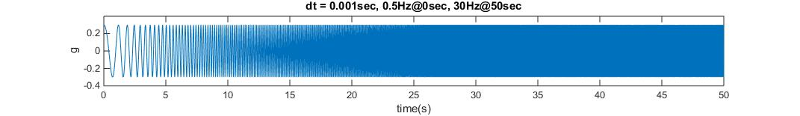
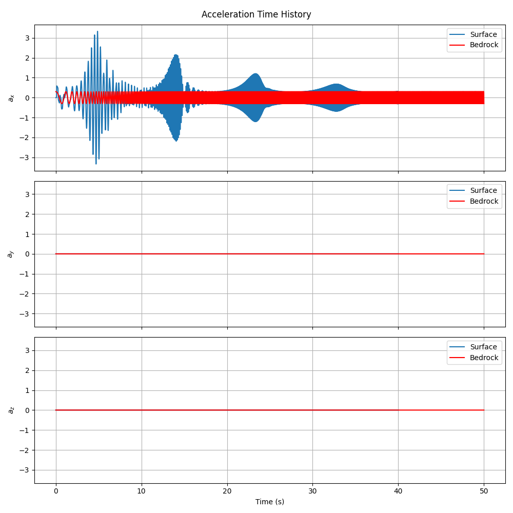
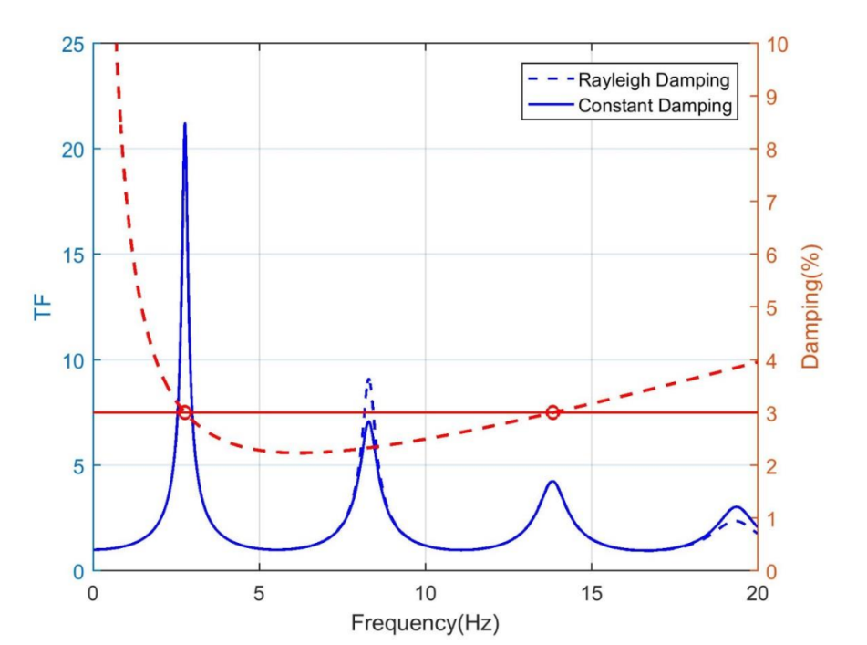

Example 1: Single-Column Site Response Analysis with Frequency Sweep
====================================================================

Overview
--------

This example demonstrates how to create a 1D site response analysis model using a single column of 3D elements in Femora. Unlike the multi-material layered model in the Quick Start guide, this example focuses on:

1. Creating a simplified single-material layered soil profile
2. Using frequency sweep input motion to test a wide frequency range
3. Comparing numerical results with analytical transfer functions
4. Running the analysis on a single processor (non-parallel execution)

The example showcases Femora's ability to perform traditional site response analyses with 3D elements while maintaining comparability with analytical solutions. This serves as an excellent verification case for more complex models.

   Frequency sweep input motion used in this example, transitioning from 0.5Hz to 30Hz over 50 seconds

Model Description
-----------------

**Soil Column:**

* Single 1m × 1m soil column in horizontal dimensions
* Total depth of 18m
* Five distinct soil layers with identical material properties (simplified homogeneous case)
  
  * Dense Ottawa Sand 1: 2.6m thick (bottom)
  * Dense Ottawa Sand 2: 2.4m thick 
  * Dense Ottawa Sand 3: 5.0m thick
  * Loose Ottawa Sand: 6.0m thick
  * Dense Montrey Sand: 2.0m thick (top)

**Materials:**

* Single elastic material used for all layers:
  
  * Shear modulus (G): 62.0e6 Pa
  * Unit weight (γ): 15.3 kN/m³
  * Shear wave velocity (Vs): 201.4 m/s (calculated)
  * Poisson's ratio (ν): 0.3 (assumed)
  * Rayleigh damping: 3% at frequencies 2.76Hz and 13.84Hz

**Mesh:**

* Element sizes: 1.0m × 1.0m horizontally
* Variable vertical discretization based on layer thickness:
  
  * Layer 1: 1.3m element height
  * Layer 2: 1.2m element height
  * Layer 3: 1.0m element height
  * Layers 4 & 5: 0.5m element height

**Loading:**

* Frequency sweep input motion (0.5Hz to 30Hz over 50 seconds)
* Applied as uniform excitation in X-direction at the base
* Used to capture the full frequency response of the soil column

**Analysis:**

* Sequential execution (single processor)
* RCM equation numberer for efficiency
* Band-General system solver (compatible with standard OpenSees)
* Newmark time integration with γ=0.5 

Implementation Details
----------------------

Let's walk through the key components of the implementation:

Material Definition
~~~~~~~~~~~~~~~~~~~

The model uses a single material type with properties representing typical sand. The material properties are derived from fundamental parameters:

.. code-block:: python

    G = 62.e6                        # Shear modulus in Pa
    gamma = 15.3                     # Unit weight in kN/m³
    rho = gamma * 1000 / 9.81        # Density in kg/m³
    Vs = (G / rho) ** 0.5            # Shear wave velocity in m/s
    nu = 0.3                         # Assumed value for Poisson's ratio
    E = 2 * G * (1 + nu)             # Young's modulus in Pa
    E = E / 1000.                    # Convert to kPa
    rho = rho / 1000.                # Convert to kg/m³

Although the model has a single material type, we create three material objects with identical properties to maintain the naming convention from the Quick Start example:

.. code-block:: python

    fm.material.create_material(material_category="nDMaterial", material_type="ElasticIsotropic", 
                              user_name="Dense Ottawa",  E=E, nu=nu, rho=rho)
    fm.material.create_material(material_category="nDMaterial", material_type="ElasticIsotropic", 
                              user_name="Loose Ottawa",  E=E, nu=nu, rho=rho)
    fm.material.create_material(material_category="nDMaterial", material_type="ElasticIsotropic", 
                              user_name="Dense Montrey", E=E, nu=nu, rho=rho)

Elements and Damping
~~~~~~~~~~~~~~~~~~~~

The elements are created with gravitational body forces in the vertical direction. A uniform Rayleigh damping is applied to all elements:

.. code-block:: python

    DensOttawaEle  = fm.element.create_element(element_type="stdBrick", ndof=3, 
                                             material="Dense Ottawa", 
                                             b1=0.0, b2=0.0, b3=-9.81 * rho)
    LooseOttawaEle = fm.element.create_element(element_type="stdBrick", ndof=3, 
                                             material="Loose Ottawa", 
                                             b1=0.0, b2=0.0, b3=-9.81 * rho)
    MontreyEle     = fm.element.create_element(element_type="stdBrick", ndof=3, 
                                             material="Dense Montrey", 
                                             b1=0.0, b2=0.0, b3=-9.81 * rho)

    # Create one damping for all the meshParts
    uniformDamp = fm.damping.frequencyRayleigh(f1=2.76, f2=13.84, dampingFactor=0.03)
    region = fm.region.elementRegion(damping=uniformDamp)

The frequencies for Rayleigh damping (f1=2.76Hz, f2=13.84Hz) were specifically selected based on the first and third natural frequencies of the soil column. This approach ensures relatively constant damping across the frequency range of interest, which is important for accurate transfer function calculation. By targeting these specific modal frequencies, the model maintains consistent energy dissipation characteristics for the predominant modes of vibration.

Layer Definition and Mesh Generation
~~~~~~~~~~~~~~~~~~~~~~~~~~~~~~~~~~~~

The soil column is modeled as a stack of five layers with varying thicknesses. Each layer has a specific discretization in the vertical direction:

.. code-block:: python

    # Define mesh dimensions
    Xmin = 0.0 ;Xmax = 1.0
    Ymin = 0.0 ;Ymax = 1.0
    Zmin = -18.;Zmax = 0.0
    dx   = 1.0; dy   = 1.0
    
    # Layer information from bottom to top
    layers = [
        {"name": "DensOttawa1", "element": DensOttawaEle,  "thickness": 2.6, "dz": 1.3},
        {"name": "DensOttawa2", "element": DensOttawaEle,  "thickness": 2.4, "dz": 1.2},
        {"name": "DensOttawa3", "element": DensOttawaEle,  "thickness": 5.0, "dz": 1.0},
        {"name": "LooseOttawa", "element": LooseOttawaEle, "thickness": 6.0, "dz": 0.5},
        {"name": "Montrey",     "element": MontreyEle,     "thickness": 2.0, "dz": 0.5},
    ]

Note how we systematically create each layer by updating the Z coordinate as we move upward through the profile:

.. code-block:: python

    Nx = int((Xmax - Xmin)/dx)
    Ny = int((Ymax - Ymin)/dy)
    
    for layer in layers:
        fm.meshPart.create_mesh_part(
            category="Volume mesh",
            mesh_part_type="Uniform Rectangular Grid",
            user_name=layer["name"],
            element=layer["element"],
            region=region,
            **{
                'X Min': Xmin, 'X Max': Xmax,
                'Y Min': Ymin, 'Y Max': Ymax,
                'Z Min': Zmin, 'Z Max': Zmin + layer["thickness"],
                'Nx Cells': Nx, 'Ny Cells': Ny, 'Nz Cells': int(layer["thickness"] / layer["dz"])
            }
        )
        Zmin += layer["thickness"]

Assembly Configuration for Single-Processor Analysis
~~~~~~~~~~~~~~~~~~~~~~~~~~~~~~~~~~~~~~~~~~~~~~~~~~~~

A key difference from the Quick Start guide is the assembly configuration. Here, we specify `num_partitions=0` for all sections to ensure the model runs on a single processor:

.. code-block:: python

    # Create assembly sections for single-processor analysis
    fm.assembler.create_section(meshparts=["DensOttawa1", "DensOttawa2", "DensOttawa3"], num_partitions=0)
    fm.assembler.create_section(["LooseOttawa"], num_partitions=0)
    fm.assembler.create_section(["Montrey"], num_partitions=0)
    
    # Assemble the mesh parts
    fm.assembler.Assemble()

Frequency Sweep Input Motion
~~~~~~~~~~~~~~~~~~~~~~~~~~~~

Instead of using an earthquake record, we use a frequency sweep signal that transitions from 0.5Hz to 30Hz over 50 seconds. This provides a comprehensive evaluation of the site response across a wide frequency range:

.. code-block:: python

    # Create a TimeSeries for the uniform excitation
    timeseries = fm.timeSeries.create_time_series(series_type="path",
                                                filePath="FrequencySweep.acc",
                                                fileTime="FrequencySweep.time",
                                                factor= 9.81)
    
    # Create a pattern for the uniform excitation
    kobe = fm.pattern.create_pattern(pattern_type="uniformexcitation",dof=1, time_series=timeseries)

Boundary Conditions
~~~~~~~~~~~~~~~~~~~

Laminar boundary conditions are essential for site response analysis to ensure one-dimensional wave propagation:

.. code-block:: python

    # Boundary conditions
    fm.constraint.mp.create_laminar_boundary(bounds=(-17.9,0),dofs=[1,2,3], direction=3)
    fm.constraint.sp.fixMacroZmin(dofs=[1,1,1],tol=1e-3)

The laminar boundaries constrain all nodes at the same elevation to move together horizontally, simulating the behavior of a shear box or infinite horizontal soil layer. The fixed base provides the location where input motion is applied.

Analysis Configuration
~~~~~~~~~~~~~~~~~~~~~~

The analysis configuration uses a Newmark integrator with modified parameters for improved numerical stability, and specifies solvers compatible with standard (non-parallel) OpenSees:

.. code-block:: python

    # Gravity analysis
    newmark_gamma = 0.6
    newnark_beta = (newmark_gamma + 0.5)**2 / 4
    dampNewmark = fm.analysis.integrator.newmark(gamma=newmark_gamma, beta=newnark_beta)
    gravity = fm.analysis.create_default_transient_analysis(username="gravity", 
                                                          dt=1.0, num_steps=30,
                                                          options={"integrator": dampNewmark})
    
    # Dynamic analysis
    system = fm.analysis.system.bandGeneral()
    numberer = fm.analysis.numberer.rcm()
    dynamic = fm.analysis.create_default_transient_analysis(username="dynamic", 
                                                          final_time=40.0, dt=0.001,
                                                          options={"system": system,
                                                                   "numberer": numberer})

A key modification is using the `bandGeneral` system solver and `rcm` numberer instead of parallel solvers. This ensures compatibility with standard OpenSees.

Process Flow and Recording
~~~~~~~~~~~~~~~~~~~~~~~~~~

The process flow includes gravity initialization, setting up the frequency sweep excitation, recording results, and exporting the tcl file:

.. code-block:: python

    mkdir = fm.actions.tcl("file mkdir Results")
    recorder = fm.recorder.create_recorder("vtkhdf", file_base_name="Results/result.vtkhdf",
                                          resp_types=["accel", "disp"], delta_t=0.001)
    reset = fm.actions.seTime(pseudo_time=0.0)
    
    # Add steps to the process
    fm.process.add_step(gravity,  description="Gravity Analysis Step")
    fm.process.add_step(kobe,     description="Uniform Excitation (Frequency Sweep)")
    fm.process.add_step(mkdir,    description="Create Results Directory")
    fm.process.add_step(recorder, description="Recorder of the whole model")
    fm.process.add_step(reset,    description="Reset pseudo time")
    fm.process.add_step(dynamic,  description="Dynamic Analysis Step")
    
    # Export the model to a TCL file
    fm.export_to_tcl("mesh.tcl")

Results and Analysis
--------------------

After running this model, we can analyze the results by comparing the generated transfer functions with analytical solutions. The post-processing script (`plot.py`) performs this analysis.

Response Time Histories
~~~~~~~~~~~~~~~~~~~~~~~

The following figure shows the comparison between input motion at the base and output motion at the surface:

   Comparison of input acceleration at the base (red) and surface response (blue) for x, y, and z components

Note the significant amplification in the horizontal (x) direction, which is characteristic of site response. The y-direction shows minimal response (as expected since excitation is only in the x-direction), while the z-direction shows some response due to Poisson's effect.

Transfer Function Comparison
~~~~~~~~~~~~~~~~~~~~~~~~~~~~

The frequency domain comparison between numerical and analytical transfer functions provides validation of the model:
            
.. figure:: ../images/SiteResponse/Example1/TFCompare.png
   :width: 600px
   :align: center
   :alt: Transfer Function Comparison

   Comparison of numerical (blue) and analytical (red) transfer functions

The analytical transfer function is calculated using the formula for one-dimensional wave propagation through a uniform elastic layer:

.. math::

   TF(f) = \frac{1}{\sqrt{\cos^2 \left( \frac{\omega H}{V_s} \right) + \left( R_{damp} \frac{\omega H}{V_s} \right)^2}}

Where:

- :math:`\omega = 2\pi f` is the angular frequency
- :math:`H` is the soil layer height
- :math:`V_s` is the shear wave velocity
- :math:`R_{damp}` is a damping coefficient based on Rayleigh damping parameters

The good agreement between numerical and analytical results validates the Femora implementation for site response analysis.

Effect of Damping Type on Transfer Function
~~~~~~~~~~~~~~~~~~~~~~~~~~~~~~~~~~~~~~~~~~~

The choice of damping model significantly affects the transfer function shape:

   Comparison of transfer functions with constant damping versus Rayleigh damping

Rayleigh damping creates frequency-dependent damping that affects the amplification at different frequencies, while constant damping provides uniform attenuation across all frequencies. The example uses Rayleigh damping to better represent the physical behavior of soils.

Simulation Visualization
~~~~~~~~~~~~~~~~~~~~~~~~

The simulation results can be visualized as an animation showing the wave propagation through the soil column:

.. raw:: html

   <video width="600" controls>
     <source src="../images/SiteResponse/Example1/movie.mp4" type="video/mp4">
     Your browser does not support the video tag.
   </video>

This animation clearly demonstrates:

1. The upward propagation of seismic waves from the base through the soil column
2. The frequency-dependent amplification as the sweep progresses from low to high frequencies
3. The phase difference between the base excitation and surface response
4. The resonance behavior at certain frequencies matching the natural frequencies of the soil column

The animation was generated using the `movie.py` script included in the example folder, which processes the VTKHDF output files to create a time-sequence visualization showing displacement and acceleration values throughout the analysis.

Conclusion
----------

This example demonstrates:

1. How to create a simplified single-column model for site response analysis in Femora
2. How to configure Femora for single-processor analysis
3. The validation of numerical results against analytical solutions
4. The importance of proper damping modeling in site response analysis

These concepts provide a foundation for more complex seismic analyses, including basin effects, nonlinear soil behavior, and soil-structure interaction.

Code Access
-----------

The full source code for this example is available in the Femora repository:

* Example directory: ``examples/SiteResponse/Example1/``
* Python script: ``examples/SiteResponse/Example1/femoramodel.py``
* Data files: ``FrequencySweep.acc`` and ``FrequencySweep.time``
* Post-processing script: ``examples/SiteResponse/Example1/plot.py``
* Animation script: ``examples/SiteResponse/Example1/movie.py`` (for creating the simulation movie)

Here's a snippet of the Python code used to create the model:

.. literalinclude:: ../../../examples/SiteResponse/Example1/femoramodel.py
   :language: python
   :caption: Example 1 - Single-Column Site Response Analysis
   :name: example1-code