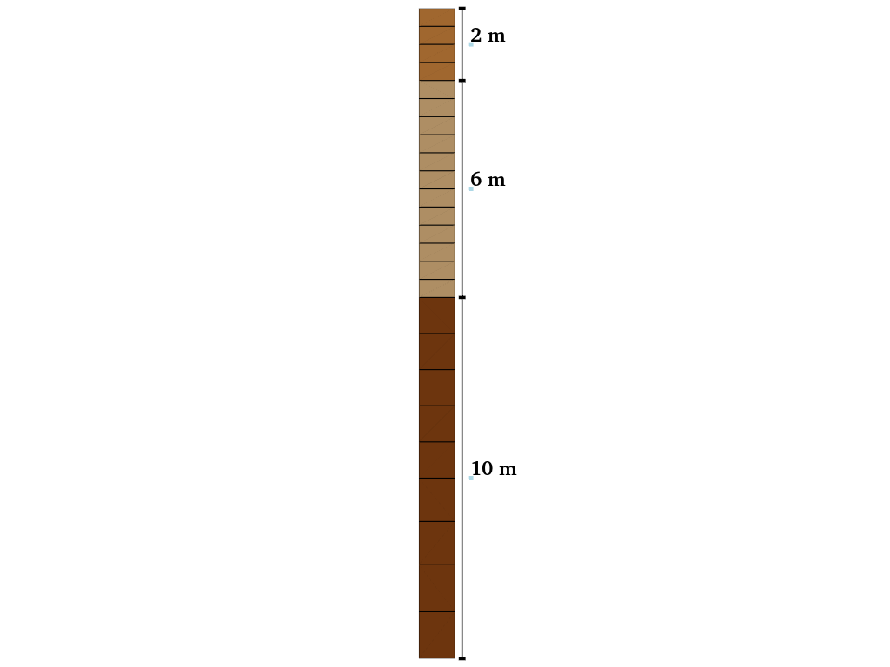
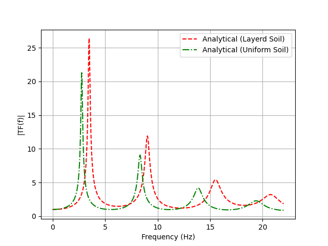

Example 2: Multi-Material Site Response Analysis with Transfer Function Comparison
==================================================================================

Overview
--------

This example builds upon Example 1 by demonstrating a 1D site response analysis with multiple materials. The key differences from Example 1 include:

1. Using three distinct soil layers with different material properties
2. Applying the ``TransferFunction`` class in Femora to compute analytical solutions
3. Comparing numerical results with analytical transfer functions calculated from the soil profile

The same frequency sweep input motion from Example 1 is used in this example.

  Schematic representation of the multi-layered soil profile used in this example.

Model Description
-----------------

**Soil Column:**

* Single 1m × 1m soil column in horizontal dimensions
* Total depth of 18m
* Three distinct soil layers with different material properties:
  
  * Layer 1: 10m thick (bottom) - Stiff material
  * Layer 2: 6m thick (middle) - Medium stiffness material
  * Layer 3: 2m thick (top) - Soft material

**Materials:**

Unlike Example 1 which used a single material with uniform properties, this example uses three distinct materials:

* Layer 1 (Bottom):

  * Shear wave velocity (Vs): 262.5 m/s
  * Unit weight (γ): 19.9 kN/m³
  * Rayleigh damping: 3% at frequencies 2.76Hz and 13.84Hz

* Layer 2 (Middle):

  * Shear wave velocity (Vs): 196.3 m/s
  * Unit weight (γ): 19.1 kN/m³
  * Rayleigh damping: 3% at frequencies 2.76Hz and 13.84Hz

* Layer 3 (Top):

  * Shear wave velocity (Vs): 144.3 m/s
  * Unit weight (γ): 19.8 kN/m³
  * Rayleigh damping: 3% at frequencies 2.76Hz and 13.84Hz

**Mesh, Loading, and Analysis:**

These aspects remain similar to Example 1, with appropriate adjustments for the different layer configuration.

Implementation Details
----------------------

Let's focus on the key differences in implementation compared to Example 1:

Material Definition with Multiple Properties
~~~~~~~~~~~~~~~~~~~~~~~~~~~~~~~~~~~~~~~~~~~~

Unlike Example 1 which used identical material properties, this example defines three distinct materials:

.. code-block:: python

    # Material properties for three distinct layers
    layer1 = {
        "vs": 262.5199305117452,  # Shear wave velocity in m/s
        "rho": 19.9*1000/9.81,    # Density in kg/m³
        "damping": 0.03,          # Damping ratio
    }
    
    layer2 = {
        "vs": 196.2675276462639,  # Shear wave velocity in m/s
        "rho": 19.1*1000/9.81,    # Density in kg/m³
        "damping": 0.03,          # Damping ratio
    }
    
    layer3 = {
        "vs": 144.2535646321813,  # Shear wave velocity in m/s
        "rho": 19.8*1000/9.81,    # Density in kg/m³
        "damping": 0.03,          # Damping ratio
    }

For each layer, the shear modulus is calculated based on the shear wave velocity and density:

.. code-block:: python

    # Calculate shear modulus and other derived properties for each layer
    for layer in [layer1, layer2, layer3]:
        rho = layer["rho"]
        Vs = layer["vs"]
        G = rho * Vs**2        # Shear modulus in Pa
        nu = 0.3               # Assumed value for Poisson's ratio
        E = 2 * G * (1 + nu)   # Young's modulus in Pa
        layer["E"] = E / 1000. # Convert to kPa
        layer["nu"] = nu
        layer["rho_model"] = rho / 1000. # Convert to t/m³

Layer Definition and Mesh Generation
~~~~~~~~~~~~~~~~~~~~~~~~~~~~~~~~~~~~

The soil column is modeled as a stack of three layers with varying properties:

.. code-block:: python

    # Create the three material types with different properties
    fm.material.create_material(material_category="nDMaterial", material_type="ElasticIsotropic", 
                              user_name="Bottom Layer",  E=layer1["E"], nu=layer1["nu"], rho=layer1["rho_model"])
    
    fm.material.create_material(material_category="nDMaterial", material_type="ElasticIsotropic", 
                              user_name="Middle Layer",  E=layer2["E"], nu=layer2["nu"], rho=layer2["rho_model"])
    
    fm.material.create_material(material_category="nDMaterial", material_type="ElasticIsotropic", 
                              user_name="Top Layer", E=layer3["E"], nu=layer3["nu"], rho=layer3["rho_model"])
    
    # Create elements with different material properties
    BottomEle = fm.element.create_element(element_type="stdBrick", ndof=3, 
                                        material="Bottom Layer", 
                                        b1=0.0, b2=0.0, b3=-9.81 * layer1["rho_model"])
    
    MiddleEle = fm.element.create_element(element_type="stdBrick", ndof=3, 
                                        material="Middle Layer", 
                                        b1=0.0, b2=0.0, b3=-9.81 * layer2["rho_model"])
    
    TopEle = fm.element.create_element(element_type="stdBrick", ndof=3, 
                                      material="Top Layer", 
                                      b1=0.0, b2=0.0, b3=-9.81 * layer3["rho_model"])

Using the TransferFunction Class for Analytical Solutions
~~~~~~~~~~~~~~~~~~~~~~~~~~~~~~~~~~~~~~~~~~~~~~~~~~~~~~~~~

A key feature of this example is the use of Femora's built-in ``TransferFunction`` class to calculate analytical solutions. This helper class, located in the ``femora.tools`` module, provides a convenient way to compute the theoretical transfer function for layered soil profiles.

In Example 1, we manually calculated the analytical transfer function using mathematical formulas. In this example, we leverage the ``TransferFunction`` class to handle the complexity of multi-layered calculations:

.. code-block:: python

    from femora.tools.transferFunction import TransferFunction
    
    # Define soil profile from top to bottom
    soil = [
        {"h": 2,  "vs": 144.2535646321813, "rho": 19.8*1000/9.81, "damping": 0.03, 
         "damping_type":"rayleigh", "f1": 2.76, "f2": 13.84},
        {"h": 6,  "vs": 196.2675276462639, "rho": 19.1*1000/9.81, "damping": 0.03, 
         "damping_type":"rayleigh", "f1": 2.76, "f2": 13.84},
        {"h": 10, "vs": 262.5199305117452, "rho": 19.9*1000/9.81, "damping": 0.03, 
         "damping_type":"rayleigh", "f1": 2.76, "f2": 13.84},
    ]
    
    # Define rock half-space properties
    rock = {"vs": 8000, "rho": 2000.0, "damping": 0.00}
    
    # Create transfer function object and compute
    tf = TransferFunction(soil_profile=soil, rock=rock, f_max=22)
    f, TF, _ = tf.compute()
    
    # Plot the results
    import matplotlib.pyplot as plt
    import numpy as np
    plt.figure(figsize=(10, 5))
    plt.plot(f, np.abs(TF))
    plt.xlabel("Frequency (Hz)")
    plt.show()

The beauty of this approach is that we can use exactly the same soil properties in both our numerical model and analytical calculation. This ensures an apples-to-apples comparison between the Femora finite element solution and the theoretical transfer function.

The ``TransferFunction`` class handles all the complex mathematics of the transfer matrix method, including:

1. Calculating the complex impedance for each layer
2. Applying the appropriate damping model (constant or Rayleigh)
3. Computing wave propagation through multiple interfaces
4. Accounting for frequency-dependent behavior

This tool makes it easy to verify numerical results against theoretical solutions, which is particularly valuable when developing more complex models.

Results and Analysis
--------------------

The transfer function comparison for this example demonstrates the accuracy of Femora in modeling wave propagation through multiple soil layers with different properties:

.. figure:: ../images/SiteResponse/Example2/TFCompare.png
   :width: 600px
   :align: center
   :alt: Transfer Function Comparison for Multi-layered Soil

   Comparison of numerical (blue) and analytical (red) transfer functions for the three-layer soil profile

The analytical transfer function is calculated using the ``TransferFunction`` class from Femora, which implements the solution for one-dimensional wave propagation through multiple elastic layers with frequency-dependent damping.

Effect of Layer Properties on Site Response
~~~~~~~~~~~~~~~~~~~~~~~~~~~~~~~~~~~~~~~~~~~

The multi-layered soil profile results in greater amplification and shifts in resonance frequencies compared to the uniform soil column in Example 1:

   Comparison of transfer functions between uniform soil (Example 1) and multi-layered soil (Example 2)

Simulation Visualization
~~~~~~~~~~~~~~~~~~~~~~~~

.. raw:: html

   <video width="600" controls>
     <source src="../images/SiteResponse/Example2/movie.mp4" type="video/mp4">
     Your browser does not support the video tag.
   </video>

This animation demonstrates:

1. The change in wave propagation velocity as waves move through different material layers
2. The reflection and refraction of waves at layer interfaces
3. The complex resonance patterns resulting from the impedance contrasts between layers

Conclusion
----------

This example demonstrates:

1. How to model a multi-layered soil profile with varying material properties in Femora
2. How to use the ``TransferFunction`` class to calculate analytical solutions for complex soil profiles
3. The importance of accurately modeling layer properties for site response analysis
4. The validation of numerical results against analytical solutions for multi-layered soil

The combination of numerical simulation with analytical verification provides confidence in Femora's ability to accurately model site response for complex soil conditions.

Code Access
-----------

The full source code for this example is available in the Femora repository:

* Example directory: ``examples/SiteResponse/Example2/``
* Python script: ``examples/SiteResponse/Example2/femoramodel.py``
* Transfer function script: ``examples/SiteResponse/Example2/TransferFunction.py``
* Post-processing script: ``examples/SiteResponse/Example2/plot.py``

Below is the complete code for this example:

.. literalinclude:: ../../../examples/SiteResponse/Example2/femoramodel.py
   :language: python
   :caption: Example 2 - Site Response Analysis with Multiple Materials
   :name: Site_Response_example2-code