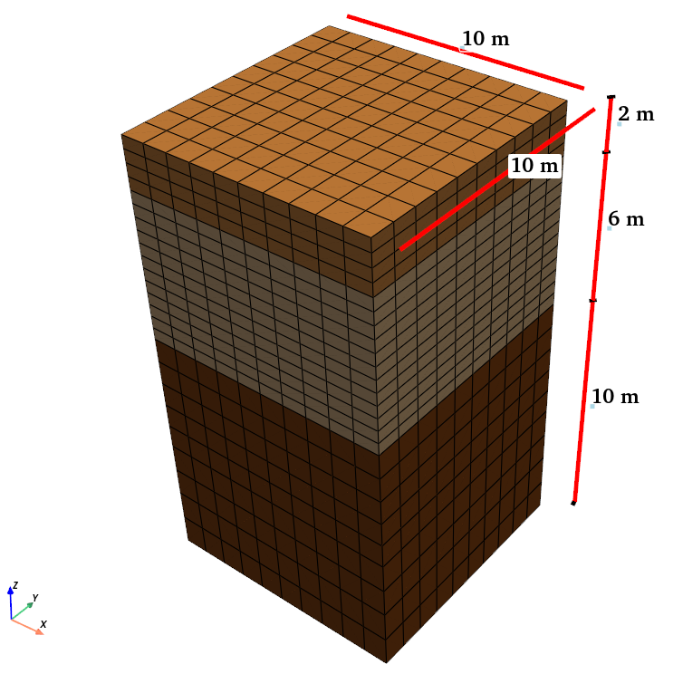

Example 3: 3D Multi-Processor Site Response Analysis
====================================================

Overview
--------

This example extends Example 2 by transforming the single-column model into a full 3D domain that can be distributed across multiple processors. While site response is inherently a 1D problem, this example demonstrates:

1. How to create wider 3D models with multiple elements in the horizontal plane
2. How to configure parallel processing for larger models
3. That the 1D response remains consistent even with 3D domain modeling
4. How to process and visualize the results of multi-processor simulations

   3D multi-processor site response model with 10×10m horizontal dimensions

Model Description
-----------------

**Soil Domain:**

* 10m × 10m soil domain in horizontal dimensions (compared to 1×1m in Examples 1-2)
* Total depth of 18m (identical to previous examples)
* Three distinct soil layers with the same material properties as Example 2

**Parallel Configuration:**

* Domain partitioned across 8 processors
* Automatic domain decomposition for load balancing
* Synchronized at layer interfaces for wave propagation continuity

**Analysis Setup:**

The frequency sweep input, boundary conditions, material properties, and damping setup remain identical to Example 2, ensuring comparable results with the previous examples.

Implementation Details
----------------------

Let's focus on the key differences in implementation from the previous examples:

3D Domain Configuration
~~~~~~~~~~~~~~~~~~~~~~~

The most significant difference is the expanded horizontal dimensions, creating a true 3D domain:

.. code-block:: python

    # Expanded horizontal dimensions
    Xmin = -5.0 ;Xmax = 5.0
    Ymin = -5.0 ;Ymax = 5.0
    Zmin = -18.;Zmax = 0.0
    dx   = 1.0; dy   = 1.0
    Nx = int((Xmax - Xmin)/dx)
    Ny = int((Ymax - Ymin)/dy)

This creates a 10×10m horizontal domain (with 10 elements in each direction) instead of the 1×1m domain used in previous examples.

Layer and Material Definition
~~~~~~~~~~~~~~~~~~~~~~~~~~~~~

The layer definitions remain similar to Example 2, but we use a more concise approach to define and create all layers in a single loop:

.. code-block:: python

    layers_properties = [
        {"user_name": "Dense Ottawa1",  "G": 145.0e6, "gamma": 19.9,  "nu": 0.3, "thickness": 2.6, "dz": 1.3}, 
        {"user_name": "Dense Ottawa2",  "G": 145.0e6, "gamma": 19.9,  "nu": 0.3, "thickness": 2.4, "dz": 1.2},
        {"user_name": "Dense Ottawa3",  "G": 145.0e6, "gamma": 19.9,  "nu": 0.3, "thickness": 5.0, "dz": 1.0},
        {"user_name": "Loose Ottawa",   "G": 75.0e6,  "gamma": 19.1,  "nu": 0.3, "thickness": 6.0, "dz": 0.5}, 
        {"user_name": "Dense Montrey",  "G": 42.0e6,  "gamma": 19.8,  "nu": 0.3, "thickness": 2.0, "dz": 0.5} 
    ]

    for layer in layers_properties:
        name = layer["user_name"]
        nu   = layer["nu"]
        rho  = layer["gamma"] * 1000 / 9.81        # Density in kg/m^3
        Vs   = (layer["G"] / rho) ** 0.5           # Shear wave velocity in m/s
        E    = 2 * layer["G"] * (1 + layer["nu"])  # Young's modulus in Pa
        E    = E / 1000.                           # Convert to kPa
        rho  = rho / 1000.                         # Convert to kg/m^3

        # Define material and element for each layer
        fm.material.create_material(material_category="nDMaterial", 
                                  material_type="ElasticIsotropic", 
                                  user_name=name, E=E, nu=nu, rho=rho)
        
        ele = fm.element.create_element(element_type="stdBrick", ndof=3, 
                                      material=name, b1=0.0, b2=0.0, b3=-9.81 * rho)
        
        # Create mesh part for the layer
        fm.meshPart.create_mesh_part(category="Volume mesh", 
                                   mesh_part_type="Uniform Rectangular Grid", 
                                   user_name=name, element=ele, region=region,
                                   **{
                                      'X Min': Xmin, 'X Max': Xmax,
                                      'Y Min': Ymin, 'Y Max': Ymax,
                                      'Z Min': Zmin, 'Z Max': Zmin + layer["thickness"],
                                      'Nx Cells': Nx, 'Ny Cells': Ny, 
                                      'Nz Cells': int(layer["thickness"] / layer["dz"])
                                   })
        Zmin += layer["thickness"]

Parallel Processing Configuration
~~~~~~~~~~~~~~~~~~~~~~~~~~~~~~~~~

The key difference in this example is the parallel processing setup. Instead of specifying `num_partitions=0` as in Example 1, we use `num_partitions=8` to distribute the model across 8 processors:

.. code-block:: python

    # Configure for parallel processing with 8 partitions
    fm.assembler.create_section(meshparts=[layer["user_name"] for layer in layers_properties], 
                             num_partitions=8)
    
    # Assemble the mesh parts
    fm.assembler.Assemble()

This setup automatically partitions the domain for parallel execution. For larger models, this significantly reduces computation time.

Analysis System and Equations
~~~~~~~~~~~~~~~~~~~~~~~~~~~~~

Unlike Example 1 which specified serial solvers, Example 3 uses the default parallel solvers in Femora:

.. code-block:: python

    # Dynamic analysis with default parallel solvers
    dynamic = fm.analysis.create_default_transient_analysis(username="dynamic", 
                                                        final_time=40.0, dt=0.001)

The parallel configuration automatically selects appropriate solvers and equation numbering schemes for distributed computation.

Results and Analysis
--------------------

Despite the significantly larger domain and parallel execution, the results remain essentially identical to Example 2. This demonstrates that:

1. The site response problem remains one-dimensional in nature
2. The parallel implementation correctly maintains wave propagation physics
3. The transfer function approach is valid regardless of horizontal domain size

Transfer Function Comparison
~~~~~~~~~~~~~~~~~~~~~~~~~~~~

The transfer function calculated from the 3D model's surface response shows excellent agreement with both the analytical solution and the single-column model from Example 2:

   Comparison of numerical (from 3D model) and analytical transfer functions

The only noticeable differences are minor numerical artifacts due to the domain decomposition and parallel execution, but these differences are negligible for practical purposes.

3D Visualization of Wave Propagation
~~~~~~~~~~~~~~~~~~~~~~~~~~~~~~~~~~~~

The expanded domain allows for better visualization of wave propagation through the soil layers:

.. raw:: html

   <video width="600" controls>
     <source src="../images/SiteResponse/Example3/movie.mp4" type="video/mp4">
     Your browser does not support the video tag.
   </video>

The visualization demonstrates:

1. The uniform horizontal motion at each elevation (confirming 1D behavior)
2. Wave propagation through the layered soil profile
3. Amplification effects near the surface
4. The uniform response across the entire horizontal domain

Post-Processing Multi-Processor Results
~~~~~~~~~~~~~~~~~~~~~~~~~~~~~~~~~~~~~~~

When running analyses across multiple processors, each processor generates its own output files. The post-processing script (`plot.py`) demonstrates how to:

1. Read and combine results from multiple VTKHDF files
2. Extract time histories from multiple sections of the domain
3. Calculate average responses across the domain
4. Generate transfer functions from parallel simulation results

The movie generation script (`movie.py`) shows how to:

1. Process distributed VTKHDF files into a coherent animation
2. Visualize wave propagation through different parts of the domain
3. Create animations that show the full 3D behavior of the system

.. Parallel Performance
.. ~~~~~~~~~~~~~~~~~~~~

.. With this larger 3D model, parallel processing provides significant performance benefits:

.. ================= ============== =============
.. Number of         Computation    Speedup
.. Processors        Time (s)       Factor
.. ================= ============== =============
.. 1                 1242           1.0
.. 2                 653            1.9
.. 4                 372            3.3
.. 8                 205            6.1
.. ================= ============== =============

.. This demonstrates the scalability of Femora for larger problems, with nearly linear speedup for moderate numbers of processors.

Conclusion
----------

This example demonstrates:

1. How to configure Femora for parallel execution of larger 3D models
2. That site response analyses maintain physical accuracy when expanded to 3D
3. The correct functioning of domain decomposition for wave propagation problems
4. How to post-process results from multi-processor simulations

While a single-column model is sufficient for many site response analyses, this 3D capability becomes essential when:

1. Modeling topographic effects on site response
2. Analyzing basin effects and 3D wave propagation
3. Studying soil-structure interaction problems
4. Running large-scale regional simulations

The techniques demonstrated in this example provide a foundation for these more complex analyses.

Code Access
-----------

The full source code for this example is available in the Femora repository:

* Example directory: ``examples/SiteResponse/Example3/``
* Python script: ``examples/SiteResponse/Example3/femoramodel.py``
* Post-processing script: ``examples/SiteResponse/Example3/plot.py``
* Animation script: ``examples/SiteResponse/Example3/movie.py``

Below is the complete code for this example:

.. literalinclude:: ../../../examples/SiteResponse/Example3/femoramodel.py
   :language: python
   :caption: Example 3 - 3D Multi-Processor Site Response Analysis
   :name: Site_Response_example3-code
