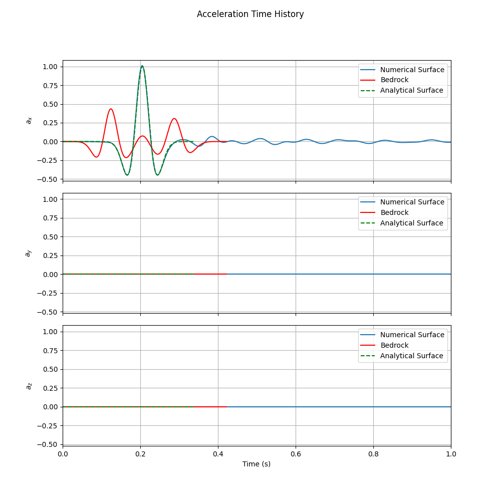

Example 4: Site Response Analysis with Deconvolution Using TransferFunction Tool
===================================================================================

Overview
--------

This example demonstrates the deconvolution capability of the ``TransferFunction`` class in Femora. Building upon Example 2's multi-layered soil profile, this example shows how to:

1. Start with a recorded surface motion (Ricker wavelet)
2. Use the ``TransferFunction`` tool to deconvolve and compute the corresponding bedrock motion
3. Apply the computed bedrock motion as input to a numerical site response analysis
4. Verify that the numerical model reproduces the original surface motion

This workflow is particularly valuable for creating Domain Reduction Method (DRM) datasets and validating site response models against recorded surface motions.

.. figure:: ../images/SiteResponse/Example2/Schematic.png
  :width: 600px
  :align: center
  :alt: Deconvolution Workflow Schematic

  Schematic representation of the deconvolution workflow: from surface motion to bedrock motion and back to surface

Model Description
-----------------

**Soil Profile:**

This example uses the same three-layer soil profile as Example 2:

* **Layer 1 (Bottom):** 10m thick - Stiff material (Vs = 262.5 m/s)
* **Layer 2 (Middle):** 6m thick - Medium stiffness material (Vs = 196.3 m/s)  
* **Layer 3 (Top):** 2m thick - Soft material (Vs = 144.3 m/s)

All material properties, including Rayleigh damping parameters, are identical to Example 2.

**Input Motion:**

Unlike previous examples that used frequency sweep inputs, this example uses a Ricker wavelet recorded at the surface. The Ricker wavelet provides a realistic broadband signal that is commonly used in seismic analysis.

Deconvolution Process
---------------------

The key innovation in this example is the use of Femora's ``TransferFunction`` class to perform deconvolution. The process is implemented in the ``deconvolve.py`` script:

Loading Surface Motion
~~~~~~~~~~~~~~~~~~~~~~

First, we load the recorded surface motion using the ``TimeHistory`` class:

.. code-block:: python

    from femora.tools.transferFunction import TransferFunction, TimeHistory
    
    # Load the surface motion (Ricker wavelet)
    record = TimeHistory.load(acc_file="ricker_surface.acc",
                              time_file="ricker_surface.time",
                              unit_in_g=True,
                              gravity=9.81)

Defining Soil Profile
~~~~~~~~~~~~~~~~~~~~~

The soil profile is defined with the same properties as Example 2:

.. code-block:: python

    soil = [
        {"h": 2,  "vs": 144.2535646321813, "rho": 19.8*1000/9.81, "damping": 0.03, 
         "damping_type":"rayleigh", "f1": 2.76, "f2": 13.84},
        {"h": 6,  "vs": 196.2675276462639, "rho": 19.1*1000/9.81, "damping": 0.03, 
         "damping_type":"rayleigh", "f1": 2.76, "f2": 13.84},
        {"h": 10, "vs": 262.5199305117452, "rho": 19.9*1000/9.81, "damping": 0.03, 
         "damping_type":"rayleigh", "f1": 2.76, "f2": 13.84},
    ]
    rock = {"vs": 8000, "rho": 2000.0, "damping": 0.00}

Performing Deconvolution
~~~~~~~~~~~~~~~~~~~~~~~~

The deconvolution is performed using the ``_deconvolve`` method of the ``TransferFunction`` class:

.. code-block:: python

    # Create transfer function instance
    tf = TransferFunction(soil, rock, f_max=50.0)
    
    # Deconvolve to get bedrock motion
    bedrock = tf._deconvolve(time_history=record)
    
    # Save the computed bedrock motion
    np.savetxt("ricker_base.acc", bedrock.acceleration, fmt='%.6f')
    np.savetxt("ricker_base.time", bedrock.time, fmt='%.6f')
    
    # Generate comparison plots
    fig = tf.plot_deconvolved_motion(time_history=record)

The ``_deconvolve`` method works by:

1. Converting the surface time history to frequency domain
2. Applying the inverse of the transfer function to remove site amplification effects
3. Converting back to time domain to obtain the bedrock motion

Numerical Verification
----------------------

The computed bedrock motion is then used as input to the same numerical model as Example 2. The numerical model applies uniform excitation at the base of the soil column using the deconvolved bedrock motion.

**Model Setup:**

The numerical model setup is identical to Example 2, with the key difference being the input motion source. Instead of using a frequency sweep, the model uses the computed bedrock acceleration as the base excitation.

**Expected Results:**

If the deconvolution and numerical modeling are accurate, the surface motion computed by the numerical model should closely match the original recorded surface motion that was used for deconvolution.

Results and Analysis
--------------------

Transfer Function Comparison
~~~~~~~~~~~~~~~~~~~~~~~~~~~~

The transfer function comparison demonstrates the accuracy of the deconvolution process:

   Comparison of analytical transfer function with numerical results from the deconvolved motion

Time History Comparison
~~~~~~~~~~~~~~~~~~~~~~~

The most important validation is the comparison between time histories:

   Comparison of time histories: original surface motion (used for deconvolution), computed bedrock motion, and numerical surface response

This figure shows three key time histories:

1. **Numerical Surface Response (blue):** The surface motion computed by applying the bedrock motion to the numerical model
2. **Computed Bedrock Motion (red):** The result of deconvolving the surface motion
3. **Original Surface Motion (green):** The Ricker wavelet recorded at the surface

The excellent agreement between the original surface motion and the numerical surface response validates both the deconvolution process and the numerical model accuracy.

Simulation Visualization
~~~~~~~~~~~~~~~~~~~~~~~~

.. raw:: html

   <video width="600" controls>
     <source src="../images/SiteResponse/Example4/movie.mp4" type="video/mp4">
     Your browser does not support the video tag.
   </video>

This animation demonstrates the wave propagation from bedrock to surface using the deconvolved input motion, showing how the original surface motion is reproduced through the soil layers.

Applications and Benefits
-------------------------

**Model Validation:**

The deconvolution process provides a powerful tool for validating site response models. By comparing the forward-modeled surface response with the original recorded motion, you can assess the accuracy of your soil profile characterization and modeling assumptions.

**Practical Workflow:**

1. Obtain recorded surface motions from seismic stations
2. Characterize the local soil profile (layering, properties)
3. Use deconvolution to compute equivalent bedrock motion
4. Apply bedrock motion to detailed numerical models
5. Validate results against recorded surface motion

Conclusion
----------

This example demonstrates:

1. The practical application of the ``TransferFunction`` class for deconvolution
2. How to create realistic bedrock motions from surface recordings
3. The validation of numerical models through time history comparison
4. A complete workflow for site-specific seismic analysis

The deconvolution capability in Femora provides a bridge between recorded seismic data and numerical modeling, enabling more realistic and validated site response analyses.

Code Access
-----------

The full source code for this example is available in the Femora repository:

* Example directory: ``examples/SiteResponse/Example4/``
* Deconvolution script: ``examples/SiteResponse/Example4/deconvolve.py``
* Numerical model script: ``examples/SiteResponse/Example4/femoramodel.py``
* Post-processing script: ``examples/SiteResponse/Example4/plot.py``

The deconvolution script is the key component of this example:

.. literalinclude:: ../../../examples/SiteResponse/Example4/femoramodel.py
   :language: python
   :caption: Example 4 - The code for building the femora model. 
   :name: Site_Response_example4_deconvolve-code
