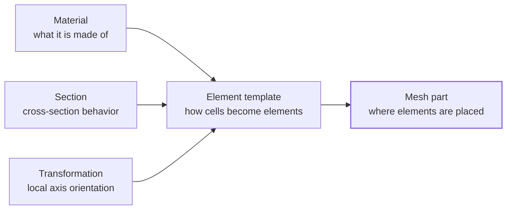
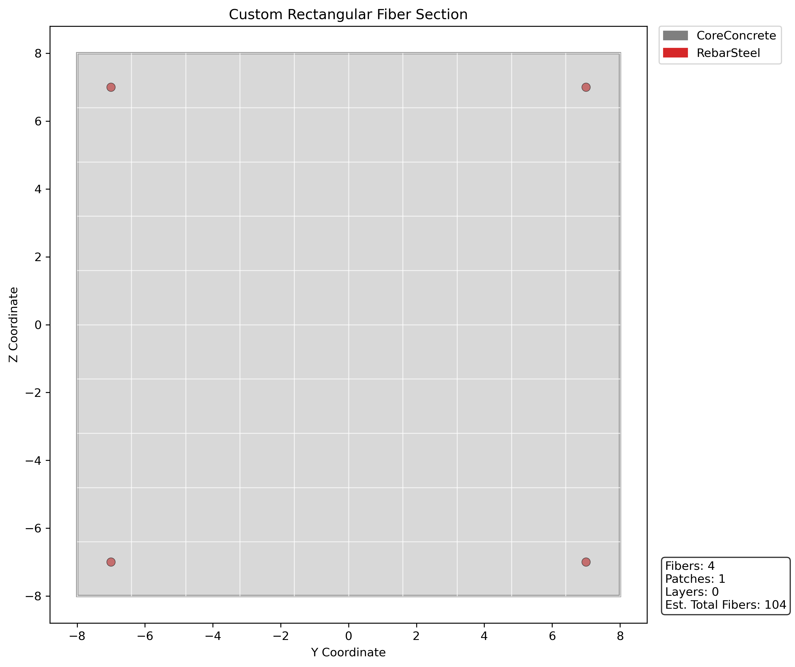
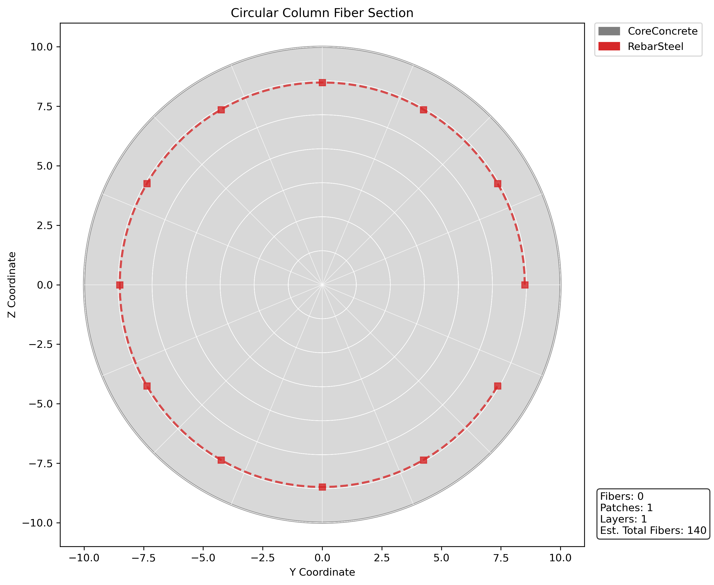

# Building Blocks

In this Concepts section, **building blocks** means the reusable pre-assembly objects you prepare before creating mesh parts: materials, sections, transformations, and element templates.

These objects do not create geometry by themselves. They describe how future mesh cells should behave when a mesh part uses them.

---

## Mental Model

Think of the workflow as preparing the mechanical recipe before placing it in space.



A material says what the domain is made of. A section says how a line, shell, or fiber-based member resists deformation. A transformation tells a frame element how its local axes are oriented. An element template combines those definitions into something a mesh part can use.

The next page explains mesh parts in detail. This page prepares the objects that mesh parts need.

???+ note "Building block first, geometry second"
    A mesh part usually needs an element template. The element template usually needs a material, section, or transformation first.

---

## How To Think

When you build a Femora model, ask these questions in order:

1. What material behavior do I need?
2. If I am modeling beams, columns, braces, shells, or fibers, what section behavior do I need?
3. If I am modeling line elements, how should their local axes be oriented?
4. What OpenSees element formulation should each mesh cell become?
5. Which mesh part will place that element template into space?

That order keeps the model readable. It also avoids a common mistake: trying to create geometry before the element template is ready.

---

## Building Block Families

| Building block | Question it answers | Usually needed by |
| --- | --- | --- |
| Material | What is the constitutive behavior? | Solid, shell, fiber, or uniaxial definitions. |
| Section | What is the cross-section or section response? | Beam, column, brace, shell, or fiber elements. |
| Transformation | How are local element axes defined? | Beam-column and other line elements. |
| Element template | How should mesh cells become OpenSees elements? | Mesh parts. |

Other objects such as loads, time series, patterns, recorders, damping, and analyses are also reusable model objects, but they belong later in the workflow. Here, the focus is the pre-assembly set needed before mesh parts can be built.

---

## Three Common Chains

Different element families need different building-block chains. Use the tabs below as a mental map.

=== "Solid volume"

    A solid mesh part usually needs an ND material and a brick element template.

    ```text
    ND material -> brick element template -> volume mesh part
    ```

    ```python
    from femora.core.model import Model

    model = Model()

    soil = model.material.nd.elastic_isotropic(
        user_name="soft_soil",
        E=5.0e4,
        nu=0.30,
        rho=1.8,
    )

    brick = model.element.brick.std(
        ndof=3,
        material=soil,
    )
    ```

    The material describes the soil behavior. The brick element template says that each future volume cell should become a standard brick element using that material.

=== "Beam or column"

    A beam or column mesh part usually needs a section, a geometric transformation, and a beam element template.

    ```text
    section + transformation -> beam element template -> line mesh part
    ```

    ```python
    from femora.core.model import Model

    model = Model()

    column_section = model.section.beam.elastic(
        user_name="column_section",
        E=2.0e8,
        A=0.45,
        Iz=0.015,
        Iy=0.015,
        G=8.0e7,
        J=0.030,
    )

    column_axes = model.transformation.transformation3d(
        transf_type="PDelta",
        vecxz_x=1.0,
        vecxz_y=0.0,
        vecxz_z=0.0,
    )

    column = model.element.beam.disp(
        ndof=6,
        section=column_section,
        transformation=column_axes,
        numIntgrPts=5,
    )
    ```

    The section defines member stiffness and strength. The transformation defines local axes. The beam element template combines both so a line mesh part can later create beam-column elements.

=== "Fiber section"

    A nonlinear frame member may use uniaxial materials inside a fiber section, then use that section in a beam element template.

    ```text
    uniaxial material -> fiber section -> beam element template -> line mesh part
    ```

    ```python
    from femora.core.model import Model

    model = Model()

    steel = model.material.uniaxial.steel01(
        user_name="steel",
        Fy=345000.0,
        E0=2.0e8,
        b=0.01,
    )

    pile_section = model.section.fiber.section(
        user_name="pile_section",
        GJ=1.0e6,
    )

    pile_section.add_circular_patch(
        material=steel,
        int_rad=0.40,
        ext_rad=0.50,
        num_subdiv_circ=32,
        num_subdiv_rad=4,
    )

    pile_axes = model.transformation.transformation3d(
        transf_type="Linear",
        vecxz_x=1.0,
        vecxz_y=0.0,
        vecxz_z=0.0,
    )

    pile_element = model.element.beam.disp(
        ndof=6,
        section=pile_section,
        transformation=pile_axes,
        numIntgrPts=5,
    )
    ```

    Here the material is not passed directly to the beam element. It is first used inside the fiber section, and the section is passed to the element template.

---

## Materials

Materials define constitutive behavior. They answer: **what does this part of the model behave like mechanically?**

=== "ND material"

    ND materials are commonly used by continuum elements such as bricks.

    ```python
    soil = model.material.nd.elastic_isotropic(
        user_name="soft_soil",
        E=5.0e4,
        nu=0.30,
        rho=1.8,
    )
    ```

=== "Uniaxial material"

    Uniaxial materials are commonly used by fiber sections, spring-like sections, and other one-dimensional material models.

    ```python
    steel = model.material.uniaxial.steel01(
        user_name="steel",
        Fy=345000.0,
        E0=2.0e8,
        b=0.01,
    )
    ```

???+ tip "Name materials by role"
    Names such as `"soft_soil"`, `"pile_steel"`, or `"bent_concrete"` are easier to debug than generic names like `"mat1"`.

---

## Sections

Sections define cross-section response. They are most important for line and frame elements because a line element does not have a physical cross-section unless you define one.

=== "Elastic section"

    Use an elastic section when you already know aggregate section properties.

    ```python
    beam_section = model.section.beam.elastic(
        user_name="beam_section",
        E=2.0e8,
        A=0.30,
        Iz=0.010,
        Iy=0.008,
        G=8.0e7,
        J=0.015,
    )
    ```

=== "Fiber section"

    Use a fiber section when the section behavior should come from material patches, layers, or fibers.

    ```python
    fiber_section = model.section.fiber.section(
        user_name="fiber_column",
        GJ=1.0e6,
    )

    fiber_section.add_circular_patch(
        material=steel,
        int_rad=0.0,
        ext_rad=0.30,
        num_subdiv_circ=24,
        num_subdiv_rad=4,
    )
    ```

???+ tip "Visualize fiber sections"
    Fiber sections can be hard to reason about from parameters alone. Plot them during development to check patch locations, reinforcement layout, and local section axes before using them in a beam element.

    === "Rectangular section"

        ```python
        sec = model.section.fiber.section(user_name="rc_beam")

        sec.add_rectangular_patch(
            material=concrete,
            num_subdiv_y=10,
            num_subdiv_z=10,
            y1=-8.0,
            z1=-8.0,
            y2=8.0,
            z2=8.0,
        )

        sec.add_fiber(y_loc=-7.0, z_loc=-7.0, area=0.79, material=steel)
        sec.add_fiber(y_loc=-7.0, z_loc=7.0, area=0.79, material=steel)
        sec.add_fiber(y_loc=7.0, z_loc=-7.0, area=0.79, material=steel)
        sec.add_fiber(y_loc=7.0, z_loc=7.0, area=0.79, material=steel)

        sec.plot(material_colors={"Concrete": "#7f7f7f", "Steel": "#d62728"})
        ```

        

    === "Circular section"

        ```python
        sec = model.section.fiber.section(user_name="rc_column")

        sec.add_circular_patch(
            material=concrete,
            num_subdiv_circ=16,
            num_subdiv_rad=8,
            y_center=0.0,
            z_center=0.0,
            int_rad=0.0,
            ext_rad=10.0,
        )

        sec.add_circular_layer(
            material=steel,
            num_fibers=12,
            area_per_fiber=0.79,
            y_center=0.0,
            z_center=0.0,
            radius=8.5,
        )

        sec.plot(material_colors={"Concrete": "#7f7f7f", "Steel": "#d62728"})
        ```

        

The section becomes a dependency of the element template. It is not geometry by itself.

---

## Transformations

Transformations define local element axes. They are especially important for beam-column elements because stiffness, section axes, and bending directions are interpreted in the element's local coordinate system.

=== "2D line element"

    ```python
    beam_axes_2d = model.transformation.transformation2d(
        transf_type="Linear",
    )
    ```

=== "3D line element"

    ```python
    beam_axes_3d = model.transformation.transformation3d(
        transf_type="PDelta",
        vecxz_x=1.0,
        vecxz_y=0.0,
        vecxz_z=0.0,
    )
    ```

For 3D frame elements, the orientation vector helps define the local element plane. If the transformation is wrong, the element may still exist, but bending directions and section interpretation can be wrong.

???+ warning "Line elements usually need transformations"
    If you are creating beam, column, brace, or pile element templates, expect to define a transformation before creating the element template.

---

## Element Templates

An element template is the last building block you usually create before a mesh part. It answers: **when a mesh part creates cells, what OpenSees element should those cells become?**

=== "Brick element"

    ```python
    brick = model.element.brick.std(
        ndof=3,
        material=soil,
    )
    ```

    A volume mesh part can use this template to turn hexahedral cells into brick elements.

=== "Beam-column element"

    ```python
    column = model.element.beam.disp(
        ndof=6,
        section=column_section,
        transformation=column_axes,
        numIntgrPts=5,
    )
    ```

    A line mesh part can use this template to turn line cells into beam-column elements.

=== "Truss-like element"

    ```python
    brace = model.element.beam.truss(
        ndof=3,
        section=brace_section,
    )
    ```

    A line mesh part can use this template when the member behavior is axial-dominant and does not need the same frame bending behavior as a beam-column element.

???+ note "Element templates are still not geometry"
    An element template has formulation and dependencies, but no coordinates. Coordinates arrive when a mesh part uses the template.

---

## How To Proceed In Practice

For each physical part of your model, prepare the building blocks in this order:

1. Decide what element family the physical part needs.
2. Create the material behavior.
3. Create section behavior if the element family needs a section.
4. Create a transformation if the element family needs local axes.
5. Create the element template.

At the end of this stage, you have the ingredients ready. The element template is the main output of the Building Blocks page. The next page shows how mesh parts take that template and place it into geometry.

???+ note "Where this sits in the workflow"
    Building blocks are Femora objects, but they belong to the pre-assembly side of the workflow. They prepare the mechanical meaning of future cells. Mesh parts then create the local geometry, and assembly later turns all source geometry into one global model.

---

## Common Mistakes

???+ warning "Do not create mesh parts before the element template is ready"
    Mesh parts need a compatible element template. Build the mechanical definition first, then place it into geometry.

???+ note "A material is not always passed directly to an element"
    Brick elements often use materials directly. Beam-column elements usually use sections, and sections may use materials internally.

???+ tip "Use object references first"
    Prefer passing Python objects such as `material=soil`, `section=column_section`, and `element=brick`. Let Femora coordinate the solver tags during export.
