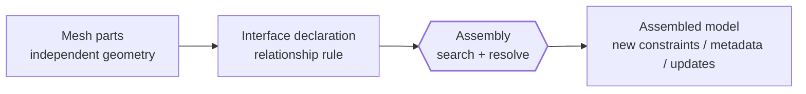

# Interfaces

Interfaces describe relationships between mesh parts that should be resolved during assembly instead of being hard-coded into one conforming mesh up front.

In other words, mesh parts define geometry separately, and interfaces tell Femora how those separate pieces should interact when the global model is compiled.

---

## Mental Model

Think of interfaces as **declared relationships** rather than finished connectivity.



An interface usually means one of these ideas:

- one part is embedded inside another
- one set of cells should search for nearby host cells
- one boundary treatment should be generated from the assembled model

The important point is that the interface is **declared before assembly**, but most of its real work happens **during assembly events**.

???+ note "Interfaces are not just geometry"
    A mesh part answers: "what geometry do I have?" An interface answers: "how should two already-defined parts relate once Femora sees the full assembled model?"

---

## Where It Fits

Interfaces belong after mesh parts and before assembly.

```text
Building blocks
  -> mesh parts
  -> interfaces
  -> assembly
  -> constraints, loads, damping, recorders, analysis
```

That ordering matters because an interface usually needs:

1. mesh parts to already exist
2. the assembled mesh to perform search, filtering, or conflict resolution

So interfaces sit at the boundary between **local modeling** and **global compilation**.

---

## What Interfaces Mean In Femora

Femora interfaces are model objects managed under `model.interface`.

They are useful when you do **not** want to force everything into one perfectly matching mesh by hand. Instead, you let Femora inspect the assembled model and generate the needed relationships.

Current interface ideas in Femora include:

| Interface idea | What it connects or generates | Typical use |
| --- | --- | --- |
| Embedded beam-solid interface | A line mesh part inside surrounding solid cells | Piles, embedded beams, beam-soil interaction |
| Embedded node interface | Node-based embedding relationship | Specialized node-to-domain coupling |
| Boundary absorber | New absorbing boundary layers derived from the assembled model | Truncating wave-reflecting boundaries |

This page focuses on the concept. The exact API surface comes from the interface manager and interface components.

---

## The Main Workflow

For most users, the interface workflow is:

1. Create the mesh parts independently.
2. Declare the interface by naming the participating parts.
3. Run assembly.
4. Let Femora resolve the relationship during event-driven assembly steps.

This is different from manually writing node-by-node constraints after export. The interface stays as a higher-level modeling object inside Femora.

---

## Minimal Examples

=== "Embedded beam in solids"

    This is the most important interface pattern in the current workflow.

    ```python
    from femora.core.model import Model

    model = Model()

    # Assume "pile" is a line mesh part and "soil_box" is a solid mesh part.
    interface = model.interface.beam_solid_interface(
        name="pile_soil_interface",
        beam_part="pile",
        solid_parts=["soil_box"],
        radius=0.50,
        n_peri=8,
        n_long=5,
        penalty_param=1.0e12,
        g_penalty=True,
    )

    model.assembler.create_section(
        meshparts=["pile", "soil_box"],
        merge_points=True,
    )
    model.assembler.assemble()
    ```

    Here the interface is declared before assembly, but the surrounding-solid search and embedded relationship generation happen only when the assembled model exists.

=== "Boundary absorber"

    Some interfaces are not part-to-part embedding relationships. They are assembly-time boundary treatments.

    ```python
    from femora.core.model import Model

    model = Model()

    model.interface.boundary.absorber(
        num_layers=3,
        geometry="rectangular",
        boundary_type="dashpot",
        rayleigh_damping=0.05,
    )

    model.assembler.assemble()
    ```

    In this pattern, the interface logic inspects the assembled boundary and then creates the absorbing treatment after assembly begins.

---

## What Femora Stores

When you create an interface, Femora stores the **relationship definition**, not just a final Tcl line.

Depending on the interface type, that can include:

- referenced mesh parts
- geometric search parameters such as radius or section envelope settings
- discretization controls such as `n_peri` and `n_long`
- penalty settings and formulation flags
- event subscriptions for assembly-time execution
- generated embedded information used for conflict resolution across cores

Conceptually, an interface is a model object that waits for the right assembly stage to do its work.

???+ tip "This is why interfaces are easier to debug than raw solver commands"
    Because the interface exists as a Femora object before export, you can inspect names, owners, participating parts, and often plot or trace the relationship before committing to the final solver script.

---

## What Happens Under The Hood

The interface system is event-driven.

The manager and component code show that interfaces subscribe to model events such as:

- `POST_ASSEMBLE`
- `RESOLVE_CORE_CONFLICTS`

That means Femora can:

- wait until the full assembled mesh exists
- search only the relevant cells or parts
- generate embedded/contact information
- resolve conflicts when parallel cores or overlapping interface results need cleanup

This is the main reason interfaces belong conceptually before assembly but computationally act during assembly.

---

## What Interfaces Are Not

Interfaces are not the same thing as ordinary constraints.

- Interfaces start from mesh-part relationships and assembly-time search.
- Constraints usually start from already-known nodes, DOFs, or assembled selections.

So even though both can eventually affect the solver domain, they solve different modeling problems.

Constraints belong later in the concept chain because users usually think about them after the assembled model exists.

---

## Common Mistakes

???+ warning "Do not use an interface when simple node merging is enough"
    If two mesh parts are meant to become one continuous domain and their coincident points should simply be merged, ordinary assembly point merging is the simpler path. Use an interface only when you need a declared relationship beyond shared nodes.

???+ warning "Do not think of interfaces as immediate solver commands"
    Creating an interface object does not finish the connection. The heavy work usually happens when `model.assembler.assemble()` triggers the relevant model events.

???+ warning "Make the participating parts explicit when needed"
    For embedded workflows, restricting the relevant solid parts is often clearer and more controllable than letting the search operate over everything.

???+ tip "Use interfaces to keep complex coupling readable"
    A named interface such as `"pile_soil_interface"` is far easier to inspect and maintain than scattering equivalent coupling logic throughout a long hand-written solver script.

---

## How To Proceed In Practice

When you reach interfaces in a model, ask:

1. Are these parts truly separate sources that need a relationship?
2. Should assembly point merging handle the connection automatically?
3. If not, what interface object best expresses the intended coupling?
4. Which participating parts should the interface search or modify?

Once those answers are clear, define the interface and move on to assembly.

---

## Related Concepts

- [Mesh Parts](mesh-parts.md): Define the independent geometric sources that interfaces relate.
- [Assembly](assembly.md): The stage where interface searches and updates actually run.
