# Concepts Overview

Femora is a Python modeling layer for building OpenSees models from reusable, inspectable parts. The important idea is that you do not write one long solver script first. You describe a model in Python, inspect it while it is still organized, assemble it into a global mesh, and then export or run the solver workflow.

---

## The Big Idea

Large finite element models are hard to maintain when geometry, material definitions, boundary conditions, loading, analysis settings, and output commands are mixed together. Femora separates those responsibilities into a sequence:

```mermaid
flowchart LR
    model(("Model"))
    managers["Managers<br/>organized namespaces"]
    components["Building blocks<br/>materials, sections, elements"]
    mesh["Mesh parts<br/>independent geometry"]
    interfaces["Interfaces<br/>relationships between mesh parts"]
    assembly{{"Assembly<br/>global mesh, tags, partitions"}}
    behavior["Model behavior<br/>constraints, loads, damping,<br/>recorders, analyses"]
    process["Process<br/>ordered execution steps"]
    results(("Export and results<br/>Tcl, VTK, JSON, solver output"))

    model --> managers
    managers --> components
    components --> mesh
    mesh --> interfaces
    interfaces --> assembly
    assembly --> behavior
    behavior --> process
    process --> results

    classDef root stroke-width:2px;
    classDef stage stroke-width:1px;
    classDef compile stroke-width:2px;

    class model,results root;
    class managers,components,mesh,interfaces,behavior,process stage;
    class assembly compile;
```



The Concepts section follows this same order. Each page explains one stage, then points to the next stage in the modeling chain.

???+ note "Femora is not just a Tcl writer"
    Femora keeps a model in memory before export. That means you can inspect mesh parts, plot intermediate geometry, debug interfaces, attach metadata, and organize outputs before committing to a solver run.

---

## Before And After Assembly

Femora is easiest to understand if you divide the workflow into three phases:

| Phase | What you do | Why it matters |
| --- | --- | --- |
| Before assembly | Create the model, managers, building blocks, mesh parts, and interfaces. | You are defining reusable ingredients and local geometry sources. |
| Assembly | Compile mesh parts and interfaces into one global assembled model. | Femora creates final topology, tags, partitions, and source metadata. |
| After assembly | Add behavior, selections, recorders, analyses, process steps, and exports. | These objects usually refer to the assembled model or solver workflow. |

This split is important because some objects must exist before assembly, while others only make full sense after the global mesh exists. Building blocks and mesh parts prepare the model. Assembly resolves the global model. Constraints, groups, damping, recorders, analyses, and process steps describe what happens to that assembled model.

---

## Why This Matters

<div class="grid cards" markdown>

-   :material-code-braces: **Scriptable**

    Build repeatable models with Python objects instead of manually maintaining one long solver script.

-   :material-eye-outline: **Inspectable**

    Plot mesh parts, interfaces, and the assembled model while developing instead of waiting until after a solver run.

-   :material-vector-combine: **Composable**

    Combine soil blocks, structural members, boundaries, and loading workflows as separate pieces.

-   :material-select-group: **Selectable**

    Target parts of the model by source, region, or group when assigning damping, recorders, and outputs.

-   :material-source-merge: **Assembly-Aware**

    Let the assembler create final connectivity, solver tags, source metadata, and interface updates.

-   :material-cpu-64-bit: **Partition-Aware**

    Prepare assembled meshes for large parallel OpenSees workflows by assigning cells to computational cores.

</div>

---

## A Femora Model In One Screen

This is the workflow shape, not a full tutorial:

```python
from femora.core.model import Model

model = Model()

# 1. Define reusable building blocks.
#    Examples: materials, sections, element templates, time series.

# 2. Use building blocks to create mesh parts.
#    Mesh parts are independent geometry sources.

# 3. Declare interfaces between mesh parts when needed.
#    Interfaces are declared before assembly because they modify the assembled model.

# 4. Assemble.
#    This creates the global mesh, final tags, partitions, and source metadata.

# 5. Add model behavior and process steps.
#    Examples: constraints, loads, damping, recorders, analyses, actions.

# 6. Export or run the workflow.
#    Examples: Tcl, VTK, JSON, solver output files.
```

The later concept pages replace these comments with concrete API examples.

---

## Three Things To Remember

### 1. The model is the workspace

`Model()` is the root object for one modeling workspace. It owns the manager namespaces, assembled mesh state, process steps, and export state.

### 2. Building blocks are reusable definitions

Materials, sections, transformations, and element templates are pre-assembly building blocks. They can be created once and reused by later mesh parts.

### 3. Assembly is the compile step

Mesh parts are source geometry before assembly. The assembler combines them into the final global mesh and resolves node tags, element tags, partitions, source metadata, and interface updates.

???+ tip "Plot early"
    A strong Femora workflow is visual and incremental: plot individual mesh parts first, assemble, then plot the assembled model with metadata such as `Core`, `ElementTag`, `FemoraPartTag`, or other exported cell data.

---

## What This Section Teaches

<div class="grid cards" markdown>

-   :material-database-outline: **[Model](model.md)**

    Understand the root workspace that keeps one Femora model organized.

-   :material-file-tree-outline: **[Managers](managers.md)**

    Learn how model-owned namespaces split creation, tracking, and coordination responsibilities.

-   :material-toy-brick-outline: **[Building Blocks](building-blocks.md)**

    Learn how materials, sections, transformations, and element templates are prepared before mesh parts.

-   :material-cube-outline: **[Mesh Parts](mesh-parts.md)**

    Define independent geometric sources that use building blocks.

-   :material-vector-link: **[Constraints and Interfaces](constraints-and-interfaces.md)**

    Understand boundary constraints and mesh-part relationships.

-   :material-source-merge: **[Assembly](assembly.md)**

    Compile independent geometry and interfaces into one assembled model.

-   :material-tag-multiple-outline: **[Tags, Sources, Regions, and Groups](tags-sources-regions-and-groups.md)**

    Organize and query the assembled finite element mesh for assignment and output.

-   :material-waveform: **[Loads, Time Series, and Patterns](loads-time-series-and-patterns.md)**

    Define static or dynamic forcing in a reusable way.

-   :material-database-export-outline: **[Damping, Recorders, and Outputs](damping-recorders-and-outputs.md)**

    Configure energy dissipation, solver outputs, and exported grids.

-   :material-cog-play-outline: **[Process and Analysis](process-and-analysis.md)**

    Choose solver settings and place analyses into an ordered workflow.

-   :material-cpu-64-bit: **[Partitioning and Parallel Execution](partitioning-and-parallel-execution.md)**

    Divide the assembled mesh into subdomains for parallel OpenSees workflows.

</div>

---

## Common Confusions

???+ warning "Mesh parts are not the final mesh"
    Global OpenSees node and element tags are finalized during assembly, not when a mesh part is created.

???+ note "Interfaces are declared before assembly"
    Interfaces reference mesh parts first, then perform detailed search or mapping work during assembly events.

???+ tip "Analysis is separate from geometry"
    The physical model and the solver process are separate. Build the model first, then define how it will be analyzed.
