# Managers

Managers are the organized namespaces attached to a `Model()`. They make a large model readable by separating responsibilities: materials live under `model.material`, elements under `model.element`, mesh parts under `model.meshpart`, analyses under `model.analysis`, and so on.

Managers are not separate models. They are coordinated access points into the same model workspace.

---

## Mental Model

If `Model()` is the workspace, managers are the labeled shelves inside that workspace.

```mermaid
flowchart TB
    model(("Model()"))

    material["model.material<br/>material definitions"]
    section["model.section<br/>section definitions"]
    element["model.element<br/>element templates"]
    transformation["model.transformation<br/>coordinate transformations"]
    meshpart["model.meshpart<br/>source geometry"]
    interface["model.interface<br/>mesh-part relationships"]
    assembler["model.assembler<br/>global assembly"]
    behavior["model.constraint / damping / load<br/>model behavior"]
    workflow["model.analysis / actions / process<br/>solver workflow"]
    recorder["model.recorder<br/>outputs"]

    model --> material
    model --> section
    model --> element
    model --> transformation
    model --> meshpart
    model --> interface
    model --> assembler
    model --> behavior
    model --> workflow
    model --> recorder

    classDef root stroke-width:2px;
    classDef manager stroke-width:1px;

    class model root;
    class material,section,element,transformation,meshpart,interface,assembler,behavior,workflow,recorder manager;
```



Each manager keeps related creation logic close to the objects it creates. This avoids one giant API surface and keeps scripts readable.

---

## Why Managers Exist

Managers solve three practical problems.

First, they organize the API. A user can write `model.material.nd.elastic_isotropic(...)` instead of searching through one enormous list of creation functions.

Second, they keep objects connected to the model. When a material, element, mesh part, analysis, or recorder is created through a manager, Femora can track it as part of that workspace.

Third, they reduce manual bookkeeping. Users should normally pass Python objects or readable names. Femora coordinates the solver-facing tags and references needed during assembly and export.

???+ note "Managers are the normal entry point"
    Direct class construction can be useful internally or for advanced workflows, but ordinary modeling should go through manager namespaces.

---

## Manager Responsibilities

Managers do not all expose identical helper methods. Some support lookup helpers, some support deletion, and some expose specialized sub-namespaces. Conceptually, they all serve the same purpose: organize model-owned definitions and make them available to later workflow stages.

| Manager | Main responsibility |
| --- | --- |
| `model.material` | Creates and tracks material definitions. |
| `model.section` | Creates and tracks section definitions. |
| `model.element` | Creates reusable element templates. |
| `model.transformation` | Creates coordinate transformation definitions. |
| `model.meshpart` | Creates independent geometry sources. |
| `model.interface` | Declares relationships between mesh parts before assembly. |
| `model.assembler` | Builds the global assembled mesh. |
| `model.constraint` | Creates SP and MP constraints. |
| `model.region` and `model.group` | Organize parts of the model for assignment, output, or selection. |
| `model.time_series` and `model.pattern` | Define time variation and loading patterns. |
| `model.damping` | Defines damping models. |
| `model.analysis` | Creates analysis definitions and solver stack pieces. |
| `model.actions` | Creates custom or predefined solver actions. |
| `model.process` | Stores the ordered execution workflow. |
| `model.recorder` | Creates solver output definitions. |

Use the API reference for exact method names. The concept to remember is that managers are model-owned namespaces, not independent storage systems.

---

## A Small Manager Chain

This example shows several managers working together:

```python
from femora.core.model import Model

model = Model()

soil = model.material.nd.elastic_isotropic(
    user_name="soft_soil",
    E=5.0e4,
    nu=0.30,
    rho=1.8,
)

brick = model.element.brick.std(
    ndof=3,
    material=soil,
)

model.meshpart.volume.uniform_rectangular_grid(
    user_name="soil_box",
    element=brick,
    x_min=0.0,
    x_max=10.0,
    y_min=0.0,
    y_max=10.0,
    z_min=-5.0,
    z_max=0.0,
    nx=10,
    ny=10,
    nz=5,
)
```

The managers split the work:

* `model.material` creates a material definition
* `model.element` creates an element template that references the material
* `model.meshpart` creates source geometry that references the element template

All three objects still belong to the same model workspace.

---

## Managers And Tags

OpenSees needs numeric tags. Users usually should not manage those tags by hand.

Femora managers help by keeping readable Python objects and names connected to solver-facing identifiers. For example, a material can be created as `soil`, referenced by an element template, then exported later with the correct material tag.

???+ tip "Use references first"
    In Python, pass objects or documented names when the API supports it. Let Femora manage the low-level solver tags.

???+ warning "Manager APIs are not all identical"
    Do not assume every manager has the same `get`, `remove`, or `list` methods. Use the API reference for exact manager-specific behavior.

---

## Practical Guidance

Use managers when you create normal model objects:

```python
material = model.material.nd.elastic_isotropic(...)
section = model.section.elastic(...)
element = model.element.beam.disp(...)
meshpart = model.meshpart.line.single_line(...)
```

Avoid building large scripts around raw integer tags unless you are writing a low-level export or debugging workflow. Tags are necessary for OpenSees, but Femora's Python layer is designed to make the model readable before it becomes Tcl.
