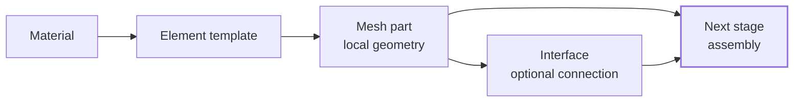

# Mesh Parts

Mesh parts are independent geometry sources. They are how Femora breaks a physical domain into meaningful modeling pieces such as soil blocks, piles, beams, slabs, imported geometry, or generated interface zones.

The previous page explained the chain from building block to element template. This page continues that chain: an element template is assigned to a mesh part, and the mesh part generates local nodes and cells before the final global model exists.

---

## The Role Of A Mesh Part

A mesh part answers a practical question:

> What piece of geometry should exist, and which element template should be used to discretize it?

For example, a mesh part can represent a soil block, a pile, a beam line, a foundation slab, a surface mesh, or an imported external mesh. Each part is named, inspectable, and can be assembled later with other parts.



???+ note "Mesh parts are source geometry"
    A mesh part contains local mesh data, but it is not the final OpenSees domain. Global node tags, global element tags, partitions, merged points, and interface updates are resolved during assembly.

---

## Mesh Part Families

<div class="grid cards" markdown>

-   :material-cube-outline: **Volume**

    3D source geometry for soil blocks, solid structures, and other volumetric domains.

-   :material-vector-line: **Line**

    1D source geometry for piles, columns, beams, braces, and repeated line grids.

-   :material-vector-square: **Surface**

    2D source geometry for surface discretizations such as circular O-grid layouts.

-   :material-database-import-outline: **General**

    Imported or prebuilt mesh data for advanced workflows.

</div>

Each family is available through a namespace under `model.meshpart`, such as `model.meshpart.volume` or `model.meshpart.line`.

---

## Why Split A Domain Into Mesh Parts?

Mesh parts are not just a coding convenience. They are the modeling boundary between different parts of the physical domain.

Use separate mesh parts when different pieces of the model have different roles:

| Modeling need | Mesh-part interpretation |
| --- | --- |
| Soil layers or zones | Separate volume mesh parts with different materials, density, or mesh spacing. |
| Piles, beams, columns, or braces | Line mesh parts using beam or line element templates. |
| Slabs, shells, or surfaces | Surface mesh parts with compatible surface elements. |
| Complex geometry created elsewhere | Imported general mesh parts. |
| Already-prepared cell data | Composite mesh parts for advanced workflows. |

This separation makes the model easier to inspect, transform, connect with interfaces, assign regions/groups, and partition later.

???+ tip "Mesh parts describe modeling intent"
    A mesh part name should usually describe the role of that piece in the model, such as `"soil_layer_1"`, `"pile_group"`, `"foundation_slab"`, or `"imported_tunnel"`.

---

## The Mesh Part Contract

A mesh part is valid when Femora can answer four questions:

1. What is this geometry source called?
2. What points and cells does it generate?
3. What element template should those cells become?
4. What metadata should follow those cells into assembly and export?

Built-in mesh parts answer these questions from high-level parameters. General and composite mesh parts give advanced users more control, but they also require more care because more of the responsibility moves to the imported or prebuilt mesh data.

| Requirement | Why it matters |
| --- | --- |
| Name | Lets assembly sections, interfaces, groups, and outputs refer to the part. |
| PyVista mesh | Stores source points and cells before assembly. |
| Compatible element template | Tells Femora how cells become OpenSees elements. |
| Region assignment | Allows damping, recorder, or region-based workflows. |
| Source metadata | Lets VTK/JSON output identify where assembled cells came from. |

???+ tip "Use built-in mesh parts first"
    Built-in mesh parts are the safest starting point because Femora generates the topology, stores the element template, assigns the mesh-part tag, and prepares the source metadata consistently.

???+ info "PyVista mesh data"
    Femora mesh parts store their source geometry as PyVista mesh data. For assembly-facing finite element cells, the important representation is usually a `pyvista.UnstructuredGrid`, which can store arbitrary cell topologies such as lines, quads, and hexahedra. See the PyVista [`UnstructuredGrid`](https://docs.pyvista.org/api/core/_autosummary/pyvista.unstructuredgrid) documentation for the underlying mesh container.

---

## Step 1: Create Compatible Building Blocks

A mesh part needs an element template. The element template usually needs material, section, or transformation definitions depending on the element family.

For a 3D solid volume, a brick element can use an ND material:

```python
from femora.core.model import Model

model = Model()

soil = model.material.nd.elastic_isotropic(
    user_name="soft_soil",  # (1)
    E=5.0e4,
    nu=0.30,
    rho=1.8,
)

brick = model.element.brick.std(
    ndof=3,
    material=soil,  # (2)
)
```

1. `user_name` gives the material a readable manager name.
2. The element template references the material object directly, so the user does not manually pass an OpenSees material tag.

The mesh part will not define the material law itself. It receives the element template, and the element template already knows which material it uses.

---

## Step 2: Create A Volume Mesh Part

Volume mesh parts are useful for soil domains, solid structures, and other 3D regions. A uniform rectangular grid creates a structured box of solid cells:

```python
soil_box = model.meshpart.volume.uniform_rectangular_grid(
    user_name="soil_box",  # (1)
    element=brick,         # (2)
    x_min=-5.0,
    x_max=5.0,
    y_min=-5.0,
    y_max=5.0,
    z_min=-10.0,
    z_max=0.0,
    nx=10,
    ny=10,
    nz=10,
)
```

1. `user_name` is the name used later by assembly sections and other model workflows.
2. `element` tells the mesh part which element template should be used for its cells.

The returned `soil_box` is a mesh part object. It has a user name, an element template, a generated PyVista mesh, and a manager-assigned mesh part tag.

You can also use other volume mesh constructors when the geometry or spacing is different:

| Namespace call | Use case |
| --- | --- |
| `model.meshpart.volume.uniform_rectangular_grid(...)` | Uniform structured 3D box. |
| `model.meshpart.volume.custom_rectangular_grid(...)` | Structured 3D box with explicit coordinate lists. |
| `model.meshpart.volume.geometric_rectangular_grid(...)` | Structured 3D box with geometric spacing ratios. |

---

## Mesh Part Examples By Family

These examples are intentionally small. They show the shape of each API rather than a complete structural model.

=== "Volume"

    ```python
    soil_box = model.meshpart.volume.uniform_rectangular_grid(
        user_name="soil_box",
        element=brick,
        x_min=-5.0,
        x_max=5.0,
        y_min=-5.0,
        y_max=5.0,
        z_min=-10.0,
        z_max=0.0,
        nx=10,
        ny=10,
        nz=10,
    )
    ```

=== "Line"

    ```python
    column = model.meshpart.line.single_line(
        user_name="column_1",
        element=beam,
        x0=0.0,
        y0=0.0,
        z0=0.0,
        x1=0.0,
        y1=0.0,
        z1=5.0,
        number_of_lines=5,
        density=2.5,
    )
    ```

=== "Surface"

    ```python
    surface = model.meshpart.surface.circular_o_grid(
        user_name="foundation_surface",
        element=quad,
        R=5.0,
        r0_ratio=0.35,
        nt=32,
        nr=8,
    )
    ```

=== "External"

    ```python
    imported = model.meshpart.general.external_mesh(
        user_name="imported_domain",
        element=brick,
        filepath="mesh.vtk",
        scale=1.0,
        translate_z=-10.0,
    )
    ```

???+ note "Examples assume compatible element templates"
    The tabbed examples focus on mesh-part creation. Variables such as `beam`, `quad`, and `brick` must be created with element templates compatible with the selected mesh part family.

---

## Step 3: Inspect Before Assembly

One of the main advantages of mesh parts is that they can be inspected before the final model is assembled.

=== "Volume"

    ```python
    # Plot the volume mesh part
    soil_box.plot(show_edges=True)
    ```

    <div class="femora-embed">
      <iframe
        src="../../assets/meshparts/family_volume.html"
        title="Volume mesh part preview"
        loading="lazy">
      </iframe>
    </div>

=== "Line"

    ```python
    # Plot the line mesh part
    column.plot(show_edges=True)
    ```

    <div class="femora-embed">
      <iframe
        src="../../assets/meshparts/family_line.html"
        title="Line mesh part preview"
        loading="lazy">
      </iframe>
    </div>

=== "Surface"

    ```python
    # Plot the surface mesh part
    surface.plot(show_edges=True)
    ```

    <div class="femora-embed">
      <iframe
        src="../../assets/meshparts/family_surface.html"
        title="Surface mesh part preview"
        loading="lazy">
      </iframe>
    </div>

=== "External"

    ```python
    # Plot the imported external mesh part
    imported.plot(show_edges=True)
    ```

    <div class="femora-embed">
      <iframe
        src="../../assets/meshparts/family_external.html"
        title="External mesh part preview"
        loading="lazy">
      </iframe>
    </div>

*Interactive previews of different mesh part families with coordinate grids and axes visible.*

At this stage, you are checking the source geometry. This is the right time to catch mistakes such as wrong dimensions, wrong mesh density, or a part placed at the wrong location.

???+ tip "Plot source parts early"
    If a model is large, debug the individual mesh parts first. It is much cheaper to inspect a small part before assembly than to debug a fully assembled solver model.

---

## Step 4: Move Or Rotate The Part

A mesh part owns a `transform` helper. This lets you move the entire source geometry without rewriting coordinate generation code.

=== "Original"

    ```python
    # Original mesh part geometry (no transformation applied)
    ```

    <div class="femora-embed">
      <iframe
        src="../../assets/meshparts/soil_box_original.html"
        title="Original soil box mesh part"
        loading="lazy">
      </iframe>
    </div>

=== "Translated"

    ```python
    # Translate the mesh part by [x, y, z]
    soil_box.transform.translate([12.0, 0.0, 0.0])
    ```

    <div class="femora-embed">
      <iframe
        src="../../assets/meshparts/soil_box_translated.html"
        title="Translated soil box mesh part"
        loading="lazy">
      </iframe>
    </div>

=== "Rotated"

    ```python
    # Rotate the mesh part about the Z-axis by an angle in degrees
    soil_box.transform.rotate_z(angle=15.0)
    ```

    <div class="femora-embed">
      <iframe
        src="../../assets/meshparts/soil_box_rotated.html"
        title="Rotated soil box mesh part"
        loading="lazy">
      </iframe>
    </div>

=== "Translated + Rotated"

    ```python
    # Apply translation followed by rotation
    soil_box.transform.translate([12.0, 0.0, 0.0])
    soil_box.transform.rotate_z(angle=15.0)
    ```

    <div class="femora-embed">
      <iframe
        src="../../assets/meshparts/soil_box_translated_rotated.html"
        title="Translated and rotated soil box mesh part"
        loading="lazy">
      </iframe>
    </div>

Transformations are useful when the same geometric idea appears in multiple locations or orientations, such as repeated structural members, rotated foundations, or model sections placed around a central feature.

???+ warning "Transform before assembly"
    Treat transformations as source-geometry operations. Apply them before assembly so the assembler sees the intended final position of each part.

---

## Line Mesh Parts

Line mesh parts represent 1D element geometry such as piles, columns, braces, or beams. They require a compatible beam element template with a section and a geometric transformation.

```python
section = model.section.beam.elastic(
    user_name="column_section",
    E=2.0e8,
    A=0.25,
    Iz=0.01,
    Iy=0.01,
    G=8.0e7,
    J=0.02,
)

transf = model.transformation.transformation3d(
    transf_type="Linear",
    vecxz_x=1.0,
    vecxz_y=0.0,
    vecxz_z=0.0,
)

beam = model.element.beam.disp(
    ndof=6,
    section=section,
    transformation=transf,
)

column = model.meshpart.line.single_line(
    user_name="column_1",
    element=beam,
    x0=0.0,
    y0=0.0,
    z0=0.0,
    x1=0.0,
    y1=0.0,
    z1=5.0,
    number_of_lines=5,
    density=2.5,
)
```

Line mesh parts can also assign nodal mass from density and section properties. The older `mass_per_length` argument is kept for compatibility, but new models should prefer `density` when possible.

| Namespace call | Use case |
| --- | --- |
| `model.meshpart.line.single_line(...)` | One straight line discretized into segments. |
| `model.meshpart.line.structured_lines(...)` | A grid of repeated parallel line elements. |

---

## Surface And General Mesh Parts

Not every source geometry is a simple box or line. Femora also supports surface and general mesh sources.

| Namespace call | Use case |
| --- | --- |
| `model.meshpart.surface.circular_o_grid(...)` | 2D circular O-grid style surface meshes. |
| `model.meshpart.general.external_mesh(...)` | Imported PyVista mesh or mesh file. |
| `model.meshpart.general.composite(...)` | Advanced prebuilt mesh data with existing tags. |

General mesh parts are for workflows where the geometry is not generated from a standard Femora parametric class.

`external_mesh` is the usual path for imported geometry: Femora reads or receives a mesh, then still uses the provided element template to understand how cells should become solver elements.

`composite` is more advanced. It is intended for prebuilt mesh data that already carries lower-level tag information such as `element_tag`, `material_tag`, or `section_tag`. This is useful for specialized import or conversion workflows, but it is not the first tool most users should reach for.

???+ warning "General meshes require discipline"
    If you use `external_mesh` or `composite`, make sure the imported topology matches the element family you assign. Femora can help with bookkeeping, but it cannot always infer whether an arbitrary imported mesh is physically meaningful.

---

## Built-In Mesh Parts And Convenience Builders

Femora has different levels of geometry helpers:

| Tool type | What it gives you | Tradeoff |
| --- | --- | --- |
| Built-in mesh part classes | Standard volume, line, surface, and imported mesh sources. | Flexible enough for most direct modeling workflows. |
| General/composite mesh parts | Control over imported or already-prepared mesh data. | Requires more care with topology, tags, and metadata. |
| Higher-level tools | Conventional structures or repeated modeling patterns built from mesh parts. | Faster for supported cases, but restricted by the assumptions of that tool. |

Higher-level building or model-generation utilities are convenient because they encode conventions. The cost is that they usually support a narrower family of geometry than explicit mesh-part construction. If you need full control, build the mesh parts directly.

---

## Regions And Mesh Parts

A mesh part can be assigned to a region. If no region is provided, Femora assigns the model's global region by default.

Regions are not the same as mesh parts. A mesh part is a source of geometry; a region is a modeling group used later for assignments such as damping, recorders, or OpenSees region commands.

```python
soil_region = model.region.element(user_name="soil_region")

soil_box = model.meshpart.volume.uniform_rectangular_grid(
    user_name="soil_box",
    element=brick,
    region=soil_region,
    x_min=-5.0,
    x_max=5.0,
    y_min=-5.0,
    y_max=5.0,
    z_min=-10.0,
    z_max=0.0,
    nx=10,
    ny=10,
    nz=10,
)
```

The exact region APIs are covered later in [Tags, Sources, Regions, and Groups](tags-sources-regions-and-groups.md).

---

## What A Mesh Part Stores

Conceptually, a mesh part stores:

| Stored item | Meaning |
| --- | --- |
| `user_name` | Human-readable name used by managers and assembly sections. |
| `mesh` | Local PyVista mesh generated by the mesh part. |
| `element` | Element template used when cells become OpenSees elements. |
| `region` | Optional region assignment. |
| `transform` | Helper for translating, rotating, or scaling the source geometry. |
| `tag` | Mesh-part tag assigned by the mesh part manager. |

The source mesh is the object you inspect before assembly. The assembled model is covered in the next concept page because it introduces point merging, final node/element tags, partitions, and global connectivity.

---

## Common Mistakes

???+ warning "Do not expect final node tags immediately"
    A mesh part has local mesh data before assembly. Final OpenSees node and element tags are created by the assembler.

???+ note "Element compatibility matters"
    A volume mesh needs a compatible solid element template. A line mesh needs a compatible line or beam element template. Femora checks compatibility for many mesh part types, but the modeling choice is still the user's responsibility.

???+ tip "Use mesh parts to keep geometry modular"
    If two regions of a model may need different mesh density, materials, transformations, interfaces, or partitions, they usually deserve separate mesh parts.
