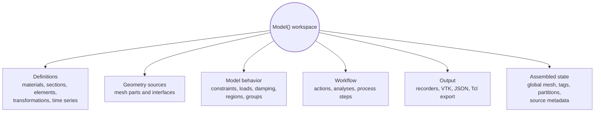

# Model

`Model()` is the root container for one Femora workspace. It is where Femora keeps the definitions, geometry sources, relationships, assembled state, process steps, and export settings that belong to one model.

The model is not only a mesh, and it is not the OpenSees domain itself. It is the Python-side workspace that lets Femora understand the whole modeling problem before writing solver commands.

---

## Mental Model

Think of a `Model()` as one project folder in memory.

Inside that project, Femora can see the materials, sections, elements, mesh parts, interfaces, constraints, loads, analyses, recorders, and process steps together. That matters because many decisions cannot be made by one isolated object.

For example:

* an element needs a material or section that belongs to the same workspace
* a mesh part needs an element template that already exists
* an interface needs to know which mesh parts it connects
* the assembler needs all active mesh parts and interfaces before it can create final node and element tags
* outputs need to know which assembled cells, regions, groups, or sources they refer to

The model gives Femora the shared context needed to coordinate these pieces.

???+ note "The model is the context"
    Individual components describe local intent. The model gives Femora the global context needed to connect them safely.

---

## What A Model Owns

One `Model()` owns one complete Femora workspace:



Creating objects records modeling intent in this workspace. Assembly and export later turn that intent into solver-ready data.

---

## Why Models Are Needed

Femora combines many component families into one final model. Materials, sections, elements, mesh parts, constraints, interfaces, damping, recorders, and analyses all have to agree with each other.

A model is the boundary where this coordination happens. It lets Femora answer questions such as:

* which definitions are available in this workspace?
* which names and tags have already been used?
* which mesh parts should be assembled together?
* which interfaces should modify the assembled model?
* which constraints, recorders, and analyses refer to the final assembled state?

Not every conflict is resolved automatically. Some checks live inside specific managers or components. The important point is that the model provides the shared place where those checks can happen.

???+ warning "Do not mix objects from different models"
    An object created in one `Model()` should not be reused in another `Model()` unless the API explicitly supports that workflow. Each model owns its own managers, tags, assembled mesh, and export state.

---

## Multiple Models

You can create more than one model in the same Python process. This is useful for parametric studies, temporary eigenvalue models, comparison runs, or building two independent problems side by side.

```python
from femora.core.model import Model

model_a = Model()
model_b = Model()

soil_a = model_a.material.nd.elastic_isotropic(
    user_name="soil",
    E=5.0e4,
    nu=0.30,
    rho=1.8,
)

soil_b = model_b.material.nd.elastic_isotropic(
    user_name="soil",
    E=8.0e4,
    nu=0.28,
    rho=1.9,
)
```

Both models can use the name `"soil"` because they are separate workspaces. `soil_a` belongs to `model_a`; `soil_b` belongs to `model_b`.

This isolation is important when you build similar models in parallel. You can reuse the same modeling idea without accidentally sharing tags, objects, assembled meshes, process steps, or recorders.

---

## Creation Is Not Execution

Creating an object stores it in the model. It does not mean OpenSees has run, and it does not mean a final global mesh exists.

```python
model = Model()

soil = model.material.nd.elastic_isotropic(
    user_name="soft_soil",
    E=5.0e4,
    nu=0.30,
    rho=1.8,
)
```

At this point, `soil` is a material definition in the Python workspace. The solver has not received any commands yet.

The typical order is:

1. create definitions
2. create mesh parts and interfaces
3. assemble the global model
4. add behavior, recorders, analyses, and process steps
5. export or run the solver workflow

---

## Practical Guidance

???+ tip "Use one model per independent problem"
    If two structures, soil domains, or analysis experiments should not share tags and state, use two `Model()` instances.

???+ note "The model is not just geometry"
    A model also owns managers, process steps, analysis definitions, recorders, source metadata, and export state.

???+ warning "Global decisions need global context"
    If you bypass the model and create disconnected objects manually, Femora may not be able to find them during assembly or export.
