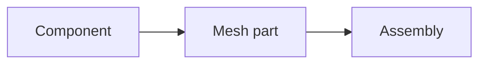

# Documentation Patterns

This page records reusable writing patterns for the Femora website. It is meant for maintainers who are editing conceptual guides, tutorials, and examples.

Prefer Material for MkDocs built-ins before writing custom HTML or JavaScript. Built-in patterns are easier to maintain, render consistently in light and dark mode, and usually work on mobile without extra styling.

---

## Concept Page Flow

Use this order for concept pages when possible:

```text
Definition -> mental model -> small example -> where it fits -> common mistakes -> next step
```

The page should teach one idea clearly. Avoid turning concept pages into API reference pages.

---

## Workflow Diagram

Use Mermaid for conceptual pipelines:

````markdown

````

Use diagrams for relationships, not for every small detail.

---

## Category Cards

Use card grids for categories or landing-page choices:

```markdown
<div class="grid cards" markdown>

-   :material-cube-outline: **Volume**

    3D mesh parts for soil blocks and solid structures.

-   :material-vector-line: **Line**

    1D mesh parts for beams, piles, columns, and braces.

</div>
```

Cards should be short. If a card needs more than a few lines, it should probably be a section.

---

## Content Tabs

Use tabs when showing parallel examples:

````markdown
=== "Volume"

    ```python
    model.meshpart.volume.uniform_rectangular_grid(...)
    ```

=== "Line"

    ```python
    model.meshpart.line.single_line(...)
    ```
````

Tabs are best for variants of the same idea, not unrelated content.

---

## Code Annotations

Use annotations to explain important arguments without interrupting the code:

````markdown
```python
soil = model.material.nd.elastic_isotropic(
    user_name="soft_soil",  # (1)
    E=5.0e4,
    nu=0.30,
    rho=1.8,
)
```

1. `user_name` is the readable name stored by the manager.
````

Keep annotations focused. If every line needs an annotation, the example is too large.

---

## Admonitions

Use admonitions to highlight operational advice:

```markdown
!!! tip "Plot early"
    Inspect mesh parts before assembly.
```

Use `note` for clarification, `tip` for workflow advice, and `warning` for mistakes that can break a model.

---

## Links And Buttons

Use normal links in prose. Use button styling only for important next actions:

```markdown
[Continue to Assembly](../concepts/assembly.md){ .md-button .md-button--primary }
```

Avoid making every link a button.
