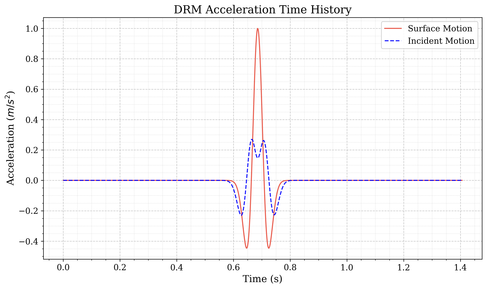
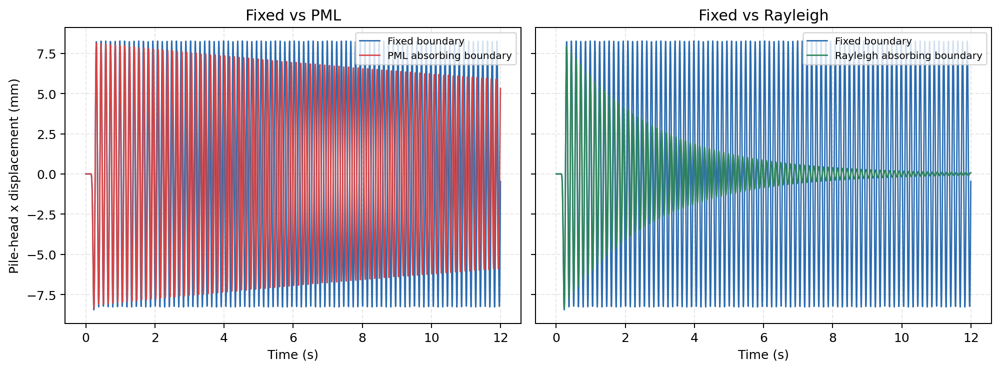

# Boundary Effects in Dynamic Pile-Soil Interaction

A ground-motion pulse excites a pile and its head mass. Waves travel through
the soil, reach the edge of the finite model, and may return to the pile.
This example compares fixed, PML, and Rayleigh boundaries to show how the
boundary treatment changes the pile's later motion.

The pile, physical soil, and incoming wave are identical in every case.
Femora's workflow feature builds the three models, runs their analyses in
parallel on Stampede3, and creates the comparison plots and movie there.

<div class="tutorial-actions" markdown>
[:material-code-braces: View source](https://github.com/GeotechUW/Femora/blob/main/examples/soil_structure_interaction/dynamic_pile_soil_interaction.py){ .tutorial-action .tutorial-action--source target="_blank" rel="noopener" }
</div>

## Model

<div class="femora-boundary-schematic">
<svg viewBox="0 0 920 500" role="img" aria-labelledby="dynamic-pile-title dynamic-pile-desc">
  <title id="dynamic-pile-title">Dynamic pile-soil boundary study</title>
  <desc id="dynamic-pile-desc">Cross-section of a pile in two soil layers with a DRM loading boundary and absorbing layers on the sides and base.</desc>
  <defs>
    <marker id="wave-arrow" markerWidth="8" markerHeight="8" refX="7" refY="4" orient="auto">
      <path d="M0,0 L8,4 L0,8 Z" fill="var(--md-accent-fg-color)" />
    </marker>
  </defs>

  <!-- Fixed exterior faces bound the absorbing elements. -->
  <line x1="90" y1="105" x2="90" y2="465" class="schematic-outer-fixity" />
  <line x1="830" y1="105" x2="830" y2="465" class="schematic-outer-fixity" />
  <line x1="90" y1="465" x2="830" y2="465" class="schematic-outer-fixity" />

  <!-- Absorbing elements exist inside the fixed lateral and base faces. -->
  <rect x="90" y="105" width="65" height="295" class="schematic-absorber" />
  <rect x="765" y="105" width="65" height="295" class="schematic-absorber" />
  <rect x="90" y="400" width="740" height="65" class="schematic-absorber" />

  <!-- A one-element DRM layer surrounds the inner soil on sides and base. -->
  <rect x="155" y="105" width="50" height="245" class="schematic-drm-layer" />
  <rect x="715" y="105" width="50" height="245" class="schematic-drm-layer" />
  <rect x="155" y="350" width="610" height="50" class="schematic-drm-layer" />

  <!-- The inner physical soil. -->
  <rect x="205" y="105" width="510" height="75" class="schematic-soil-upper" />
  <rect x="205" y="180" width="510" height="170" class="schematic-soil-lower" />

  <line x1="460" y1="63" x2="460" y2="325" class="schematic-pile" />
  <rect x="436" y="42" width="48" height="28" rx="3" class="schematic-mass" />

  <!-- Small wave fronts radiate from several elevations along the pile. -->
  <path d="M450 150 C430 146, 414 148, 394 157" class="schematic-wave" />
  <path d="M470 150 C490 146, 506 148, 526 157" class="schematic-wave" />
  <path d="M450 215 C428 211, 410 214, 388 225" class="schematic-wave" />
  <path d="M470 215 C492 211, 510 214, 532 225" class="schematic-wave" />
  <path d="M450 280 C430 277, 414 281, 394 292" class="schematic-wave" />
  <path d="M470 280 C490 277, 506 281, 526 292" class="schematic-wave" />

  <text x="460" y="30" text-anchor="middle" class="schematic-label">Pile-head mass</text>
  <text x="475" y="94" class="schematic-label">Pile</text>
  <text x="220" y="137" class="schematic-label">Upper soil: Vs = 190 m/s</text>
  <text x="220" y="210" class="schematic-label">Lower soil: Vs = 240 m/s</text>
  <text x="460" y="382" text-anchor="middle" class="schematic-drm-label">One-element DRM layer</text>
  <text x="460" y="440" text-anchor="middle" class="schematic-absorber-label">PML or Rayleigh absorbing layer</text>
  <text x="545" y="286" class="schematic-label">Radiated waves</text>
  <text x="850" y="165" transform="rotate(90 850 165)" class="schematic-fixed-label">Fixed exterior face</text>
</svg>
</div>

The schematic shows an absorbing-boundary case. The inner soil is followed by
one DRM element layer, then the PML or Rayleigh absorbing layer. Fixities are
applied at the exterior side and base faces, outside the absorbing elements.
The ground surface remains free. In the `Fixed` case, the absorbing layer is
omitted and the exterior faces of the finite soil domain are constrained.

The physical model contains a two-layer elastic soil domain and an embedded
beam-column pile carrying a lumped mass at its head. The embedded interface
transfers motion and force between the pile and the surrounding brick
elements. The physical soil is undamped in all three analyses. Additional
Rayleigh damping, where used, is assigned only to the absorbing regions.

The soil box is 16 m long, 6 m wide, and 8 m deep. Its upper 2 m have a shear
wave velocity of 190 m/s; the lower 6 m have a velocity of 240 m/s. The pile
extends from 5 m below the ground to a head mass 2 m above it. The analysis
runs for 12 seconds with a 0.001-second time step.

## Apply The Same Incident Wave

The starting motion is a Ricker pulse prescribed at the ground surface. Femora
first deconvolves that target through the two-layer soil profile to obtain the
corresponding incident motion. It then creates an H5DRM load around the
physical domain. This supplies the same incoming wave field to every boundary
case.

<div class="femora-result-figure" markdown>

</div>

## Change Only The Outer Boundary

The workflow creates the following three cases automatically:

- `Fixed` constrains the exterior side and bottom faces. Waves reflect from
  these faces, providing the baseline response.
- `PML` adds three layers of PML elements to attenuate outgoing waves. PML
  already provides attenuation through its formulation: extra Rayleigh
  damping is not required to make it an absorber. This particular run includes
  a supplementary 10% Rayleigh damping target in the PML region.
- `Rayleigh` adds five layers of ordinary elastic elements with a strong
  95% Rayleigh damping target. Those elements do not have a PML formulation;
  their added damping is what dissipates outgoing-wave energy.

The additional damping is outside the physical soil so that it removes energy
in the numerical absorbing region rather than damping the pile's surrounding
soil directly. The two absorber settings are not equivalent. In particular,
PML's 10% supplementary damping is not its total attenuation, and neither
Rayleigh target is a constant damping ratio at every frequency.

PML and Rayleigh therefore add cells outside the physical soil mesh; they do
not replace or reshape the physical domain. Each case writes to a separate
output directory so its response can be compared without overwriting another
case.

## Build The Model

These tabs follow the main modeling steps in `build_model()`. They explain
what each part contributes and show selected code from the example. Variables
such as `model`, `soil_parts`, and `pile_section` are defined by the surrounding
script; the excerpts are not separate runnable programs.

=== "1. Soil"

    Create two elastic soil layers and mesh them with uniform brick elements.
    Assign each layer its shear wave velocity and density. Keep the physical
    soil undamped so the boundary treatments, rather than added soil damping,
    control the differences between cases.

    Inside the layer loop, convert the wave velocity to elastic stiffness and
    create the brick element:

    ```python
    density = unit_weight * 1000.0 / gravity
    shear_modulus = density * vs**2
    material = model.material.nd.elastic_isotropic(
        user_name=f"{name}_material",
        E=2.0 * shear_modulus * 1.3,
        nu=0.3,
        rho=density,
    )
    element = model.element.brick.std(ndof=3, material=material)
    ```

    Inside the block loop, mesh that layer with uniform spacing:

    ```python
    model.meshpart.volume.geometric_rectangular_grid(
        user_name=part_name,
        element=element,
        region=soil_region,
        x_min=block_x_min,
        x_max=block_x_max,
        y_min=block_y_min,
        y_max=block_y_max,
        z_min=z_min,
        z_max=z_max,
        nx=nx,
        ny=ny,
        nz=layer_nz,
        x_ratio=1.0,
        y_ratio=1.0,
        z_ratio=1.0,
    )
    ```

=== "2. Pile"

    Create an elastic beam-column pile along the vertical axis, from -5 m to
    +2 m, using 16 elements. Its section defines the axial, bending, and
    torsional stiffness. Add a 25,000 kg lumped mass at the head in the
    x direction, where the incoming wave excites the model.

    ```python
    pile_element = model.element.beam.disp(
        ndof=6,
        section=pile_section,
        transformation=transformation,
        numIntgrPts=5,
    )
    model.meshpart.line.single_line(
        user_name="pile",
        element=pile_element,
        x0=0.0,
        y0=0.0,
        z0=PILE_BOTTOM,
        x1=0.0,
        y1=0.0,
        z1=PILE_HEAD,
        number_of_lines=PILE_ELEMENTS,
    )
    model.mass.meshpart.closest_point(
        meshpart_name="pile",
        xyz=(0.0, 0.0, PILE_HEAD),
        mass_vec=(25_000.0, 0.0, 0.0),
        combine="override",
    )
    ```

=== "3. Interface"

    Embed the pile in the soil using a beam-solid interface. It couples the
    pile's motion to the surrounding brick elements without requiring the
    beam and soil nodes to coincide. `beam_part` identifies the pile mesh;
    `solid_parts` identifies the soil meshes to which it is coupled.

    ```python
    pile_soil_interface = model.interface.beam_solid_interface(
        name="pile_soil_interface",
        beam_part="pile",
        solid_parts=soil_parts,
        radius=radius,
        n_peri=8,
        n_long=3,
        penalty_param=1.0e12,
        g_penalty=True,
    )
    ```

=== "4. Boundary"

    Leave the ground surface free and constrain the outer sides and base.
    For Fixed, no absorbing shell is added. For PML or Rayleigh, add the
    corresponding shell outside the physical soil before applying fixities
    at its exterior faces. Only the absorbing region receives the additional
    damping described above.

    ```python
    --8<-- "examples/soil_structure_interaction/dynamic_pile_soil_interaction.py:boundary-treatment"
    ```

=== "5. DRM load"

    Generate the shared H5DRM file once from the two-layer soil profile and
    the prescribed surface pulse. Each model reads that same file and applies
    the wave field at the DRM boundary. This keeps the incoming excitation
    identical while the outer boundary treatment changes.

    ```python
    --8<-- "examples/soil_structure_interaction/dynamic_pile_soil_interaction.py:drm-input"
    ```

=== "6. Analysis"

    Assemble and partition each model, then define its transient analysis
    with the Newmark integrator and a 0.001-second time step. Record
    displacement through the 12-second run. After all three solves finish,
    the postprocessor extracts the pile-head motion and renders the movie.

    ```python
    --8<-- "examples/soil_structure_interaction/dynamic_pile_soil_interaction.py:analysis-and-process"
    ```

## Run As A Remote Workflow

The example uses one workflow with four steps. All of the work below runs
remotely; the submitted Python code generates the large model and DRM files
on Stampede3 rather than uploading them from your computer.

1. Create the common DRM input once.
2. Build the Fixed, PML, and Rayleigh models.
3. Solve all three models concurrently: 8 MPI ranks for Fixed, 16 for PML,
   and 16 for Rayleigh, using 40 of the node's 48 rank slots.
4. Extract the pile-head histories and create the plots and movie after every
   analysis finishes.

The returned archive contains the plots, displacement CSVs, movie, Tcl models,
and solver logs. The much larger VTKHDF recorder files remain in the remote
working directory and are not included by default.

## Results And Post-Processing

These results come from the complete 12-second remote analysis. Each panel
compares one absorbing treatment with the same fixed-boundary baseline.

<div class="femora-result-figure" markdown>

</div>

The initial x-response peaks are similar, at about 8.4 mm. With no physical
soil damping or absorbing layer, the fixed-boundary response keeps oscillating
at nearly constant amplitude. The PML response decays gradually, while the
strongly damped Rayleigh-layer response decays much faster.

The Rayleigh case has both a thicker absorbing region and a much higher
damping target, which helps explain its faster decay. However, these curves
measure pile-head motion, not reflected waves directly: faster decay alone
does not establish that one boundary reproduces an unbounded soil domain
more accurately.

<video controls preload="metadata" playsinline style="width: 100%;"
       poster="../../assets/examples/dynamic-pile-soil-interaction/boundary-comparison-preview.png">
  <source src="../../assets/examples/dynamic-pile-soil-interaction/boundary-comparison.mp4" type="video/mp4">
  Your browser does not support embedded video.
</video>

[Download the comparison movie](../assets/examples/dynamic-pile-soil-interaction/boundary-comparison.mp4)

The movie shows the 12-second simulation over 24 seconds, at 20 frames per
second. The top row shows soil layers and the pile; the bottom row shows
x-displacement contours. All panels use a quarter cut, perspective projection,
and 20-times displacement magnification. The red pile-head sphere is symbolic.

The postprocessor reads displacement at the pile head, `(0, 0, 2)` m. The CSV
files retain all three components; the comparison plot focuses on x, the
direction of the applied motion. No separate postprocessing command is needed:
the workflow runs it on Stampede3.

## Submit The Example

You need a DesignSafe account with access to Stampede3, an eligible allocation,
and access to a registered Femora workflow app. The app's remote environment
must provide Femora, OpenSeesMP, and the rendering dependencies.

At the bottom of the example file, edit the `settings` passed to `fm.submit()`.
Use the app ID and allocation available to your account:

```python
settings={
    "app_id": "YOUR_REGISTERED_FEMORA_APP",
    "system": "stampede3",
    "queue": "skx-dev",
    "allocation": "YOUR_ALLOCATION",
    "nodes": 1,
    "cores_per_node": 48,
    "minutes": 120,
}
```

Then submit from your Femora checkout:

```bash
python examples/soil_structure_interaction/dynamic_pile_soil_interaction.py
```

Femora prompts for your DesignSafe login and prints a job UUID after
submission. The remote workflow creates and runs all three cases automatically.
To check progress and download the completed outputs, open:

```bash
femora jobs track
```

Press **L** to log in, select your job, and press **Enter** for details or **D**
to download its outputs after completion. Keep the returned job UUID; do not
submit the example again merely to check its status.

For the general workflow API, see the
[step-by-step workflow guide](../concepts/workflows.md).

??? example "Complete source"
    ```python
    --8<-- "examples/soil_structure_interaction/dynamic_pile_soil_interaction.py"
    ```
