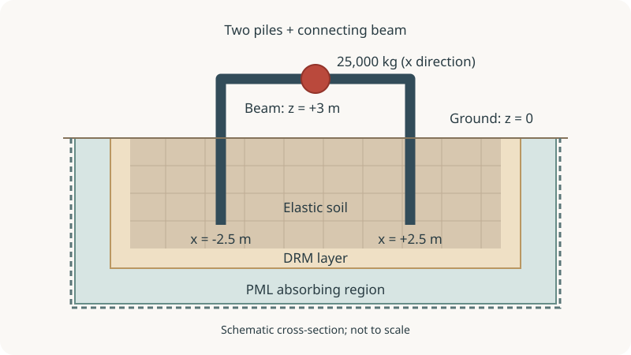
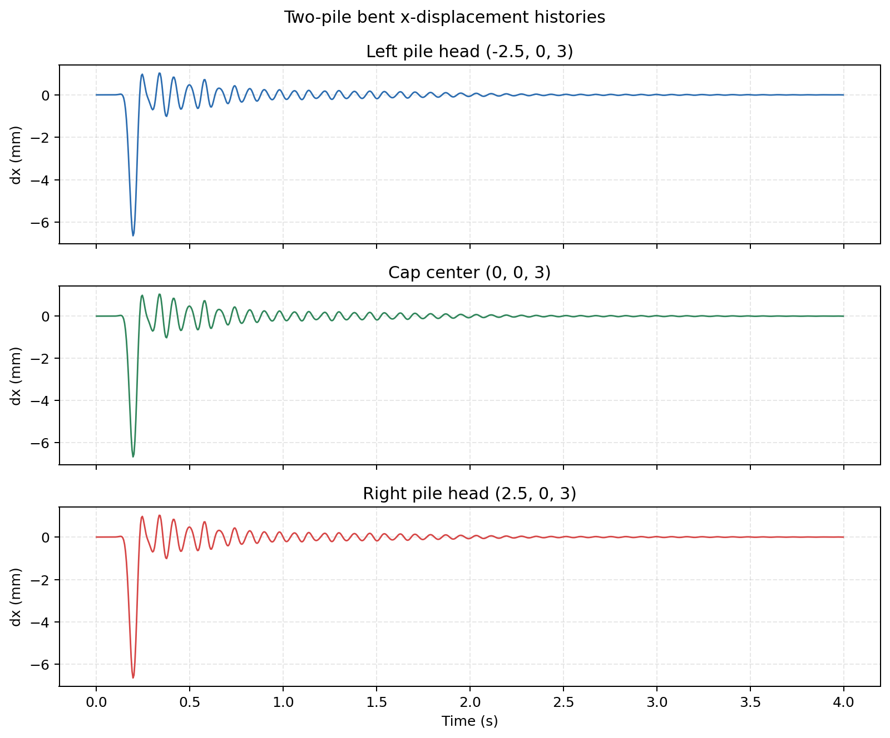
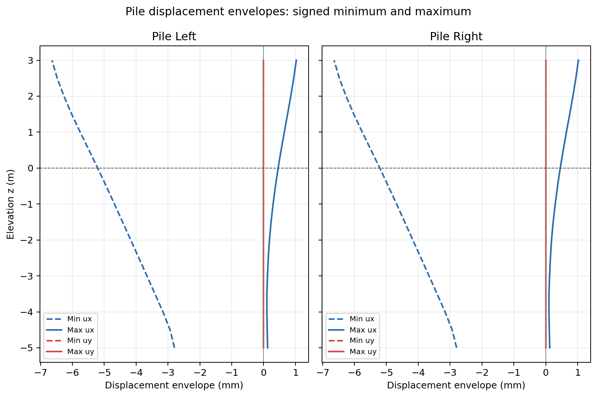
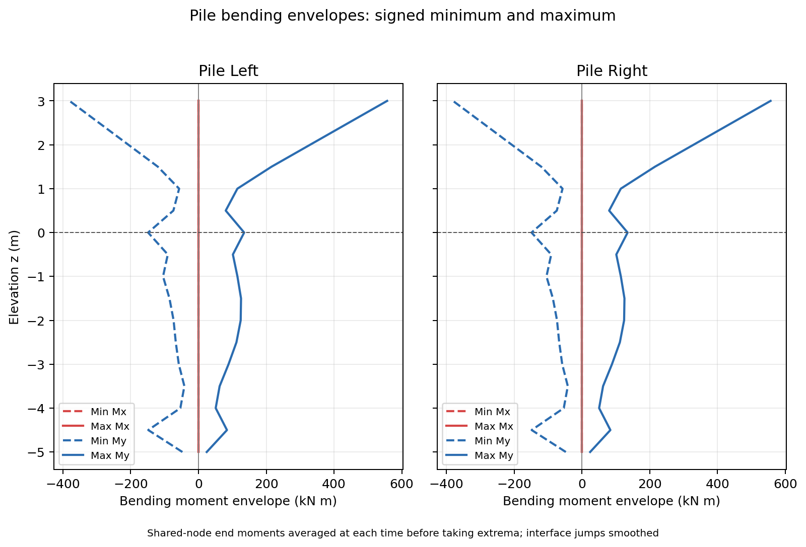

# Two-Pile Bent Under DRM Excitation

Two embedded piles support an elevated connecting beam and a mass at its
center. A ground-motion pulse travels through the soil and excites the bent.
We will build this connected frame, couple both piles to the soil, and follow
how the incoming wave moves the frame and bends the piles.

If you are new to embedded pile interfaces, start with the
[laterally loaded pile](laterally-loaded-pile.md). The
[dynamic single-pile example](dynamic-pile-soil-interaction.md) introduces the
wave-loading and absorbing-boundary setup used here.

We use Femora's workflow to generate the wave input, build and solve the model,
then create the response plots and movie on Stampede3. The large model and
DRM files are created there rather than uploaded from your computer.

<div class="tutorial-actions" markdown>
[:material-code-braces: View source](https://github.com/GeotechUW/Femora/blob/main/examples/soil_structure_interaction/two_pile_bent_drm.py){ .tutorial-action .tutorial-action--source target="_blank" rel="noopener" }
</div>

## Model



The physical soil box is 16 m long, 6 m wide, and 8 m deep. It uses homogeneous
elastic soil with Young's modulus 200 MPa, Poisson's ratio 0.4, and density
2,100 kg/m3. Bricks have 0.5 m spacing, giving 32 by 12 by 16 cells.
No material damping is assigned to the physical soil.

The piles lie at `x = -2.5` m and `x = +2.5` m, with `y = 0`. Both extend from
`z = -5` m to `z = +3` m. Each has 16 beam-column elements and a circular
1.5 m diameter elastic section. Two connecting beam segments meet at
`(0, 0, 3)` m. At this joint, we assign a 25,000 kg nodal mass to represent
lateral inertia in the x direction. We do not assign vertical or rotational
inertia to that mass. The connecting beam uses the same section as the piles
and can bend; it is not a rigid cap.

The beam ends share structural nodes with the pile heads, so the structure
forms one connected frame. To transfer motion and load between that frame and
the soil, we couple the buried pile surfaces with embedded beam-solid interfaces.
The above-ground portions remain free of soil coupling.

Because the soil box is finite, outgoing waves would otherwise reflect from
its edges and return to the bent. We surround the sides and base with four
layers of perfectly matched layer (PML) elements, outside the DRM loading layer.
We also assign 5% supplementary Rayleigh damping to the PML region, without
matching the undamped physical soil. This is an additional numerical damping
choice, not a requirement of PML. The 5% target
applies at the Rayleigh calibration frequencies (0.2 and 20 Hz); damping varies
with frequency. We fix the PML's exterior faces and leave the ground surface
free. These absorbing
elements are a numerical boundary, not another physical soil layer.

## Build The Bent

The tabs follow the construction order. The code comes from the complete
example; excerpts use variables defined by the surrounding script.

=== "1. Soil"

    Start with homogeneous elastic soil and a uniform brick mesh. The same
    bounds and spacing are used when generating the DRM points, so the load
    coordinates agree with the model boundary.

    ```python
    --8<-- "examples/soil_structure_interaction/two_pile_bent_drm.py:soil"
    ```

=== "2. Piles and beam"

    Define the circular section, then create the two vertical piles and the
    two horizontal beam segments. Assembly merges their coincident structural
    endpoints, making one connected bent rather than four independent lines.
    The transformation's reference vector is perpendicular to both the
    vertical piles and the horizontal beam segments.

    ```python
    --8<-- "examples/soil_structure_interaction/two_pile_bent_drm.py:piles"
    ```

=== "3. Interfaces"

    Couple each pile to the physical soil with an embedded beam-solid
    interface. The interface samples its cylindrical surface and finds the
    surrounding brick elements; the two meshes need not share soil nodes.
    Both interfaces use the same radius and penalty parameters. Finally, add
    the x-direction mass at the connecting beam's center to represent its
    lateral inertia.

    ```python
    --8<-- "examples/soil_structure_interaction/two_pile_bent_drm.py:interface"
    ```

=== "4. Boundary"

    Add the PML shell and assemble the soil and bent. The physical model uses
    eight partitions and the PML uses eight more. Fix only the outside faces,
    so waves can travel from the soil into the absorber before reaching a
    constrained boundary.

    ```python
    --8<-- "examples/soil_structure_interaction/two_pile_bent_drm.py:boundary"
    ```

=== "5. Analysis"

    With the model connected and its boundary defined, set up a Newmark
    transient analysis with a 0.001 s time step for 4 s. Record displacement,
    velocity, and acceleration every 0.005 s to follow the motion. Add beam-force
    recorders for pile bending and interface recorders for the interaction-point
    response, so we can also examine how the soil transfers load to the piles.
    The solve uses one OpenSeesMP process for each of the 16 model partitions.

    ```python
    --8<-- "examples/soil_structure_interaction/two_pile_bent_drm.py:analysis"
    ```

## Generate The Incoming Motion

To excite this model, we start with a Ricker acceleration pulse prescribed
at the ground surface.
To obtain the incoming wave that produces this pulse, we use a soil column
with the same properties and depth as the 3D model, over a stiff elastic
half-space. `create_drm()` deconvolves the surface pulse through this profile
and uses the resulting motion to create the wave input.

The domain reduction method (DRM) applies this incoming field along a layer
near the edge of the soil mesh. Here the wave travels vertically, with motion
in the x direction. The input calculation contains soil but no piles: it
describes the ground motion before the structure disturbs it.

With the incoming motion determined, `create_drm()` writes the DRM input on
a grid matching the soil mesh:

```python
--8<-- "examples/soil_structure_interaction/two_pile_bent_drm.py:incoming-motion"
```

The input must exist before the model can use it, so we make its generation
the first workflow task. `create_drm()` writes `drmload.h5drm` in its own task folder
and returns the file path for `build_model()` to use. Both functions run on
the cluster; we upload only the small surface-motion files.

For the deconvolution step, see
[Deconvolved Ricker-Wave Site Response](deconvolved-ricker-site-response.md).

## Run The Workflow

Now connect the input calculation, model construction, solver, and
postprocessing in one workflow. The stages run in this order:

1. `input/drm` creates the shared `drmload.h5drm` file.
2. `build/bent` creates both piles, the beam, soil, interfaces, and PML, then
   exports `model.tcl` and a small element-to-geometry mapping.
3. `solve/bent` launches that Tcl model with 16 OpenSeesMP ranks.
4. `postprocess/responses` creates histories, pile deformation profiles, and
   force and moment outputs. Then `postprocess/movie` renders the animation.
   These two tasks run sequentially; both use the completed solver output.

```python
--8<-- "examples/soil_structure_interaction/two_pile_bent_drm.py:workflow"
```

The workflow workspace is the shared remote run directory. Each Python
task receives a `context`: `context.workspace` points to that shared directory,
while `context.output_dir` points to the task's own folder. For example,
the build task writes inside `build/bent`. It retrieves the DRM file path
with `context.result("input", "drm")`, the value returned by `create_drm()`.

After a successful run, the relevant folders look like this:

```text
workspace/
|-- motions/                         # Uploaded small motion inputs
|-- two_pile_bent_drm_postprocess.py  # Uploaded postprocessor
|-- input/drm/drmload.h5drm           # Generated remotely
|-- build/bent/
|   |-- model.tcl                    # Generated remotely
|   |-- pile_geometry.json           # Pile element tags, partitions, and endpoints
|   `-- results/                     # Large recorder files
|-- solve/bent/stdout.log
`-- postprocess/
    |-- responses/                  # Histories, pile profiles, and moment envelopes
    `-- movie/                      # MP4, preview, and rendering settings
```

For a fuller explanation of stages, task folders, and return values, see the
[workflow guide](../concepts/workflows.md).

## Read The Response

After the solve, we first look at the frame's overall motion. The postprocessor
queries the undeformed coordinates of the left pile head
`(-2.5, 0, 3)`, the beam center `(0, 0, 3)`, and the right pile head
`(2.5, 0, 3)`. Femora searches the partitioned results for each point; it does
not assume a particular recorder file contains a particular structural node.

It saves all three displacement components and plots the x histories in
millimeters, the direction of the incoming motion. These histories let us
compare the connecting beam's center with the two pile heads during and
after the pulse.

### Response To The Pulse

The figure below comes from the 16-rank remote run with the 5% supplementary
PML damping described above. It shows node displacements in the global x
direction, not displacement relative to the surrounding soil.



All three locations reach their largest displacement near 0.196 s, then
oscillate with decreasing amplitude. The two pile heads move almost together,
consistent with the symmetric bent and the incoming wave field. The beam
center follows a similar history, with a slightly larger peak. Similar motion
does not make the connecting beam rigid; it remains an elastic part of the model.

| Location | Peak absolute x displacement |
| --- | ---: |
| Left pile head | 6.64 mm |
| Beam center | 6.67 mm |
| Right pile head | 6.64 mm |

The solver reaches 4 s. Each plotted history has 800 samples, from 0.001 to
3.996 s at 0.005 s intervals; the final solver step falls after the last
recorder sample. These histories show the response of this configuration,
not a comparison that isolates the effect of the PML or its extra damping.

### Pile Deformation And Bending Moments

The head histories describe the frame's overall motion. To see what happens
below the heads, we next extract displacement along each pile using its
structural beam nodes, rather than nearby soil nodes.



Solid curves show the maximum signed displacement at each elevation; dashed
curves show the minimum. Both use the full four-second record. The x motion
dominates, while the y response is close to zero. The two sides need not be
symmetric: we take the actual minimum and maximum, not the absolute peak and
its negative. An envelope combines extrema reached at different times; it is
not a deformed shape at one instant.

Motion alone does not tell us the bending demand, so we also read the recorded
beam end forces and moments. The example provides both XML beam-force and
VTKHDF recorders. VTKHDF support for `force3D` and `localForce3D` depends on
the OpenSees version and build;
the postprocessor uses XML for the bending plots below.



The bending envelopes show **global Mx and My** in kN m. My dominates because
the incoming motion acts in the x direction. Solid curves show maxima and
dashed curves show minima over the full record.

Adjacent element end moments are put in a common sign convention and averaged
at each shared node before taking the minimum and maximum over time. This
smoothing gives one value per elevation for presentation; it is not a recovered
section-moment diagram. The raw beam and interface forces remain unchanged.

To investigate where the soil transfers load to a pile, we can go further
with the interface records. These provide force and displacement responses at
the sampled interaction points, including axial, radial, and tangential
contributions. They let us follow how the interaction varies along the buried
surface and over time. The interface's `beamForce` output instead gives the
equivalent actions at beam ends, which can be used with the beam-force records
to examine load balance; it is distinct from the point-level response.

### Deformation Movie

<video controls preload="metadata" playsinline style="width: 100%;"
       poster="../../assets/examples/two-pile-bent-drm/two_pile_bent_preview.png">
  <source src="../../assets/examples/two-pile-bent-drm/two_pile_bent.mp4" type="video/mp4">
  Your browser does not support embedded video.
</video>

The movie shows the first two seconds at half speed, with displacement
magnified **120 times** for visibility. The soil cut exposes the right pile,
and the red sphere represents the center mass. The plots above use the full
four-second record and unscaled displacements.

## Submit The Example

To run this workflow yourself, use a DesignSafe account with Stampede3 access,
an eligible allocation, and access to a registered Femora workflow app
providing Femora and OpenSeesMP.
At the bottom of the script, replace the app ID and allocation with yours.
The shown SKX development-queue request reserves one node with 48 rank slots;
this model uses 16 of them. Other queues need their own compatible settings.

```python
settings={
    "app_id": "YOUR_REGISTERED_FEMORA_APP",
    "system": "stampede3",
    "queue": "skx-dev",
    "allocation": "YOUR_ALLOCATION",
    "nodes": 1,
    "cores_per_node": 48,
    "minutes": 120,
}
```

Submit from your Femora checkout:

```bash
python examples/soil_structure_interaction/two_pile_bent_drm.py
```

Femora prompts for login and returns a job UUID. To monitor the job and
download the derived results, use:

```bash
femora jobs track
```

Log in with **L**, select the job, and press **Enter** for details or **D** to
download completed output. Checking a job does not require submitting it again.

??? example "Complete source"
    ```python
    --8<-- "examples/soil_structure_interaction/two_pile_bent_drm.py"
    ```
